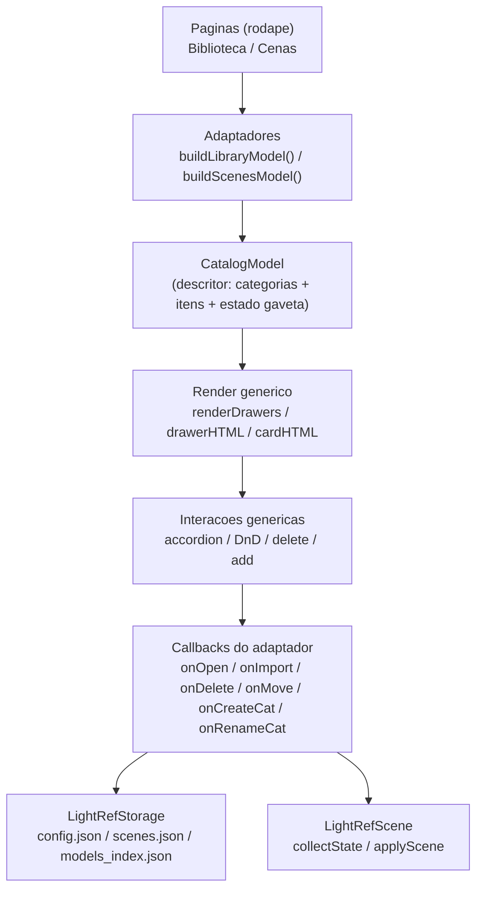
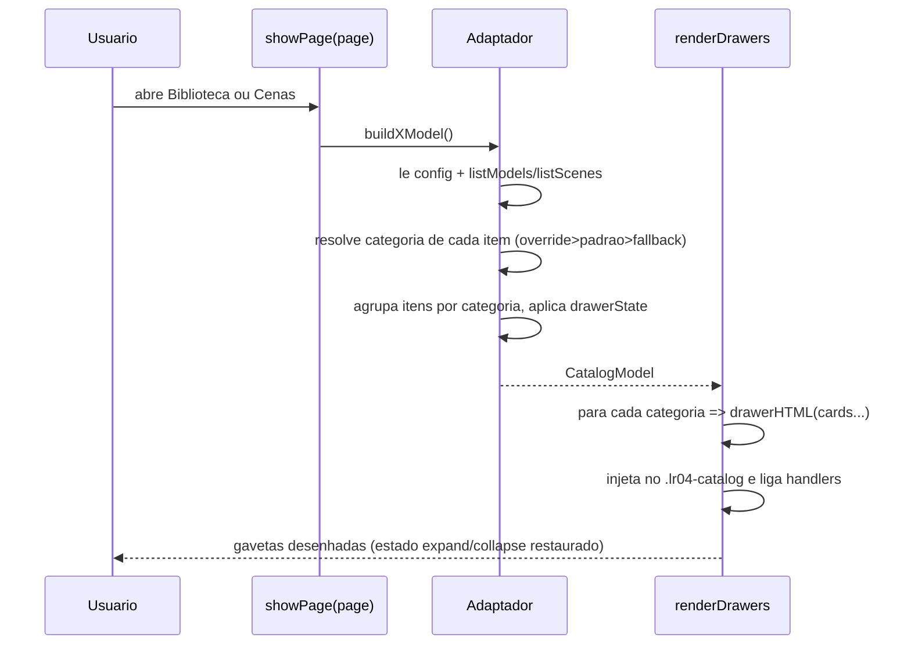
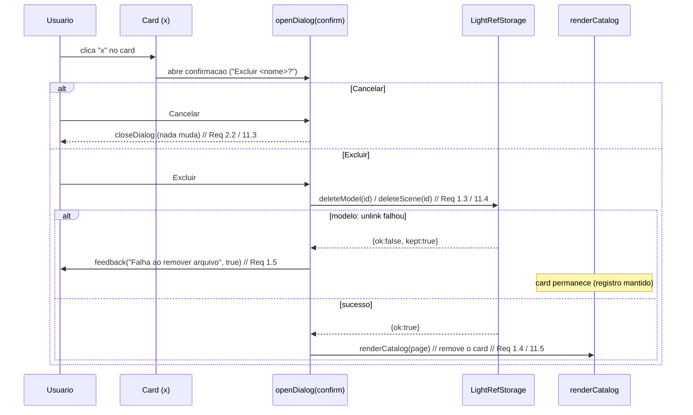
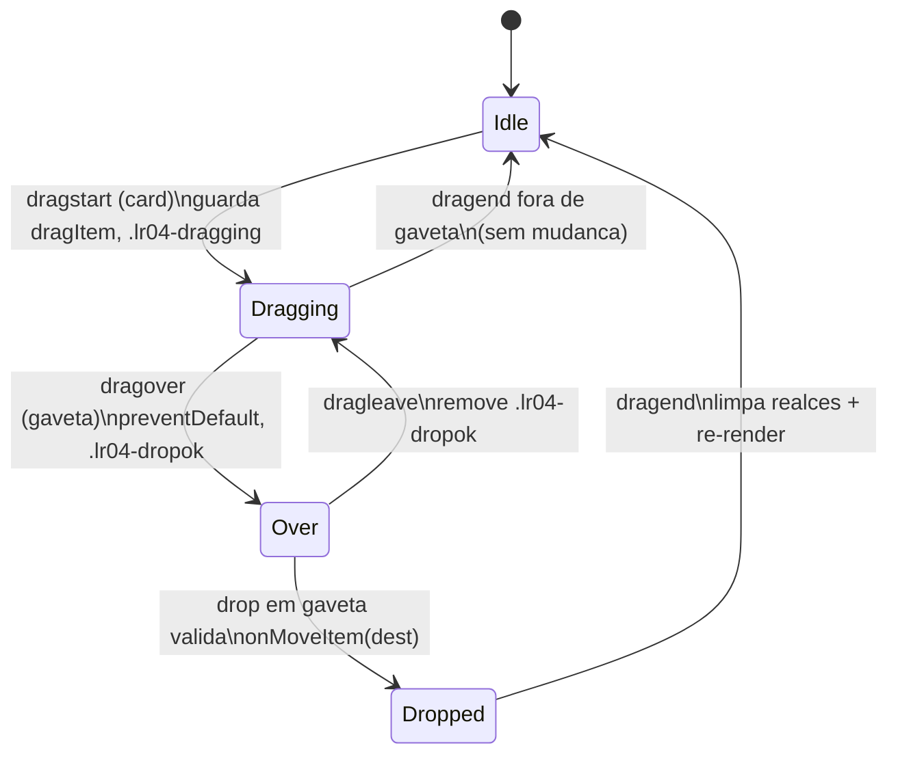

# Design Document

## Overview

Esta feature reorganiza as paginas **Biblioteca** (`renderCatalog('library')`) e **Cenas** (`renderCatalog('scenes')`) do plugin LightRef, transformando as duas galerias planas de hoje em catalogos identicos baseados em **gavetas (accordion) por categoria**, com card de "Adicionar modelo", delecao com confirmacao, edicao de categorias e arrastar-e-soltar HTML5. Ela tambem amplia `collectState()` / `applyScene()` para capturar e restaurar o **Estado_Completo** do estudio (Requisitos 13 e 14).

O trabalho e inteiramente client-side dentro do painel CEP. Nao ha build step: todo codigo e ES5 puro, ASCII-only, compativel com CEF 99 / Chromium 99 (sem arrow functions, `let`/`const`, classes, template literals, `Promise` nativa, `async/await`). A persistencia continua via `LightRefStorage` (escrita atomica).

### Principio central: um so componente de catalogo para as duas paginas

Hoje `renderCatalog(page)` tem dois ramos quase totalmente separados (um monta a Biblioteca, outro monta as Cenas). O usuario pediu que "a base da biblioteca sirva as duas". O design introduz um **renderizador de catalogo generico orientado a dados**: as duas paginas descrevem seus itens e categorias atraves de um mesmo *descritor* (`CatalogModel`), e um unico conjunto de funcoes (`renderDrawers`, `cardHTML`, `drawerHTML`, e os handlers de accordion / DnD / delete) desenha as gavetas. Biblioteca e Cenas passam a ser apenas dois *adaptadores* que produzem esse descritor e reagem aos eventos (clicar, importar, deletar, mover).

### Achados da leitura do codigo (baseline real)

- `panel.js`
  - `renderCatalog(page)` (linhas ~867-918): dois ramos. `library` monta secoes por categoria **fixa no codigo** (`order = ['Cabecas','Bustos e Torsos','Figuras','Formas basicas','Outros']`) e uma secao "Meus modelos" a partir de `LightRefStorage.listModels()`. `scenes` monta uma galeria plana + botao "Salvar cena atual".
  - Card atual (Biblioteca): `<button class="lr04-card" data-defurl="URL">preview<strong>titulo</strong><small>tag</small></button>`; importados usam `data-model="ID"`. Cenas: `<button class="lr04-card" data-scene="ID">...`.
  - `preview(url)` resolve a thumb: override em `config.modelThumbs[url]` > thumb fixa `models/thumbs/<base>.png` (so para `MODELS`/`SHAPES`) > icone SVG.
  - `openDialog(title, bodyHtml)` / `closeDialog()` **ja existem** (linhas ~921-922) e usam `.lr04-modal` / `#lr04-modal-title` / `.lr04-modalbody`. `bindDialog()` liga `[data-action="close"]`.
  - `saveScenePrompt()` ja usa `openDialog` para pedir o nome e chama `LightRefStorage.saveScene(name, collectState(), thumb)`.
  - `collectState()` (linhas ~942-961) hoje captura: `model`, `rotation` (yaw/pitch/roll), `background`, `lights` (name/color/intensity/azimuth/elevation/enabled/softness/sourceSize), `fx`, `focal`, `projection`, `material`, `materialParams`, `formColor`, `environment`, `envIntensity`. **Faltam**: offset (posicao X/Y/Z) e escala (scaleMult) do modelo.
  - `applyScene(state)` (linhas ~962-...) carrega o modelo com `loadModel(model, applyRest)` e em `applyRest` restaura material/params/formColor/rotation/background/projection/focal/environment/envIntensity, substitui as luzes (remove todas + `add`), aplica `fx`. **Falta**: restaurar offset e scale; e nao ha tratamento de falha de carregamento do modelo (Req 14.8) nem fallback item-a-item para cenas antigas (Req 14.9, hoje resolvido por acaso por `if (state.campo)`).
  - `MODELS[]` tem `.cat` ('Cabecas','Bustos e Torsos','Figuras'); `SHAPES[]` nao tem `.cat` (tratados como 'Formas basicas' no render).
  - `#file-input` e `onFilePicked()` fazem a importacao via `LightRefStorage.importModel(file.path, nome)`; o fluxo de "Importar" seta `data-import="1"` antes de `.click()`.
- `storage.js`
  - `readConfig()` / `writeConfig(cfg)` (merge read-modify-write, nao apaga chaves de outras origens). `listScenes()` / `saveScene(name,state,thumb)` (sobrescreve por nome) / `deleteScene(id)`. `listModels()` / `importModel(src,nome)` / `modelFileURL(rec)` / `deleteModel(id)` (ja apaga o arquivo com `try/catch`, **engole a falha** hoje).
  - Cena no disco: `{ id, name, createdAt, state:{...}, thumb, updatedAt? }`. **Nao tem** campo `categoryId` ainda.
- `scene.js` (motor, API estavel)
  - Getters/setters existentes que o design vai usar: `getModelRotation()/setModelRotation(yaw,pitch)` + `getModelRoll()/setModelRoll(deg)`, `getModelOffset()/setModelOffset(axis,value)`, `getModelScaleMult()/setModelScaleMult(m)`, `getBackground()/setBackground(mode,color)`, `getEnvironment()/setEnvironment(url,opts)`, `getEnvIntensity()/setEnvIntensity(v)`, `getFocalLength()/setFocalLength(mm)`, `getProjection()/setProjection(mode)`, `getMaterial()/setMaterial(type)`, `getMaterialParams()/setMaterialParam(name,value)`, `getFormColor()/setFormColor(hex)`, `standardThumbnail(cb)`, `thumbnailDataURL()`, `lightManager` (`add(opts)`, `remove(id)`, `get(id)`, `update(id,field,value)`, `lights[]`).
  - Luzes sao sempre `DirectionalLight`; o campo "tipo" citado no Req 13.3 e representado pelo par azimuth/elevation (nao ha varios tipos de luz hoje). O estado por luz e: `name,color,intensity,azimuth,elevation,enabled,softness,sourceSize`.
- `postfx.js`
  - `getParams()` / `applyParams(obj)`. Campos (NEUTRAL): `exposure, temperature, contrast, saturation, blackWhite, posterizeOn, posterizeLevels, cutoutOn, cutoutLevels`. `applyParams` ja preenche faltantes com o neutro (bom para cenas antigas).
- `index.css`
  - `.lr04-catalog` cobre a area do estudio. `.lr04-gallery` = grid 4 colunas (`repeat(4,minmax(0,1fr))`), cards `.lr04-card` retrato (aspect 3/4), `.lr04-placeholder`, `.lr04-widebutton`, `.lr04-modal`. Precisaremos de classes novas para gaveta (`.lr04-drawer`, `.lr04-drawerhead`, `.lr04-drawerbody`), card "+" (`.lr04-card-add`), estados de DnD (`.lr04-dragging`, `.lr04-dropok`) e acao de deletar no card (`.lr04-card-del`).

## Architecture

### Camadas e responsabilidades



A ideia: o **render** e as **interacoes** nao sabem se estao desenhando modelos ou cenas. Eles operam sobre um `CatalogModel` neutro e disparam callbacks. Os **adaptadores** (`buildLibraryModel`, `buildScenesModel`) sabem das regras de cada dominio (thumbs, quem pode ser deletado, onde persistir a categoria).

### Fluxo de renderizacao (accordion)



### Restricoes tecnicas mantidas

- ES5 puro: usar `function`, `var`, concatenacao de strings; nenhum recurso ES6+.
- ASCII-only nos arquivos JS.
- Drag and Drop via API HTML5 padrao (`draggable`, `dragstart`, `dragover`, `dragleave`, `drop`, `dragend`), toda suportada no Chromium 99.
- Persistencia sempre por `LightRefStorage` (escrita atomica; `writeConfig` faz merge e nao apaga chaves).
- Reaproveitar `openDialog`/`closeDialog`, `.lr04-card`, `.lr04-gallery` e `feedback()` (a `.lr04-notice`).

## Components and Interfaces

Todas as funcoes novas ficam dentro do IIFE de `panel.js` (mesmo escopo de `renderCatalog`). Nenhuma nova global exceto as poucas adicoes a `LightRefStorage`.

### 1. Descritor de catalogo (CatalogModel)

Estrutura JS (nao persistida; construida a cada render):

```
CatalogModel = {
  page: 'library' | 'scenes',
  categories: [ CategoryDesc, ... ],   // ja em ordem de exibicao
  canCreateCategory: true,
  canImport: true|false,               // true so na Biblioteca (mostra card "+")
  emptyHint: 'texto quando nao ha itens'
}

CategoryDesc = {
  id: 'Cabecas' | 'cat_123' | '__outros__' | '__sem__',
  name: 'Cabecas',
  builtin: true|false,                 // categorias padrao de MODELS nao renomeaveis? (ver Decisao D2)
  renamable: true|false,
  expanded: true|false,                // vem do drawerState
  items: [ ItemDesc, ... ]
}

ItemDesc = {
  id: 'models/asaro.obj' | 42 (id importado) | 1699999 (id cena),
  kind: 'defmodel' | 'mymodel' | 'scene',
  title: 'Asaro',
  subtitle: 'Cabecas' | 'Meu (obj)' | '',
  thumbHTML: '' | '<div class="lr04-placeholder">...</div>',
  deletable: true|false,               // so mymodel e scene
  draggable: true|false                // todos os itens de card sao arrastaveis
}
```

### 2. Funcoes de renderizacao generica

- `renderCatalog(page)` — **reescrita**: vira um dispatcher fino. Monta o `CatalogModel` chamando o adaptador e delega a `renderDrawers`.
  ```
  function renderCatalog(page){
    var model = (page === 'library') ? buildLibraryModel() : buildScenesModel();
    renderDrawers(model);
  }
  ```
- `renderDrawers(model)` — monta o HTML de todas as gavetas + barra de acoes de topo (botao "Nova categoria" e, em Cenas, "Salvar cena atual"), injeta em `.lr04-catalog`, chama `refreshIcons()` e liga todos os handlers (`bindDrawerHandlers`, `bindCardHandlers`, `bindDnD`, `bindCatalogActions`).
- `drawerHTML(cat)` — retorna o HTML de uma gaveta:
  ```
  <section class="lr04-drawer" data-cat="ID" aria-expanded="true|false">
    <header class="lr04-drawerhead" tabindex="0">
      <button class="lr04-drawertoggle">&#9656; NOME (N)</button>   // seta gira via CSS
      <span class="lr04-drawertools">[renomear]</span>              // so se renamable
    </header>
    <div class="lr04-drawerbody lr04-gallery" hidden?>...cards...[card "+" se for a Biblioteca]</div>
  </section>
  ```
- `cardHTML(item)` — retorna um `.lr04-card` unico usado nas DUAS paginas:
  ```
  <button class="lr04-card" draggable="true"
          data-kind="defmodel|mymodel|scene" data-id="..." data-cat="ID">
    <span class="lr04-card-del" title="Excluir">x</span>   // so se deletable
    THUMB
    <strong>TITULO</strong>
    <small>SUBTITULO</small>
  </button>
  ```
  O `data-cat` no card guarda a categoria de origem (necessario ao mover). O `.lr04-card-del` fica escondido por CSS ate hover (ou sempre visivel; ver Decisao D3).
- `addCardHTML()` — card especial "Adicionar modelo":
  ```
  <button class="lr04-card lr04-card-add" data-action="add-model" title="Adicionar modelo">
    <span class="lr04-plus">+</span><strong>Adicionar</strong>
  </button>
  ```

### 3. Adaptadores de dominio

- `buildLibraryModel()`:
  1. Le `cfg = LightRefStorage.readConfig()`; obtem `modelCategories`, `modelCatOverrides`, `drawerState.library`.
  2. Lista modelos importados: `LightRefStorage.listModels()`.
  3. Resolve a categoria de cada item via `resolveModelCategory(itemId, cfg)` (ver logica abaixo).
  4. Monta a ordem de categorias: padrao (`Cabecas, Bustos e Torsos, Figuras, Formas basicas`) + custom (na ordem de `modelCategories`) + `Outros` (so se tiver item).
  5. Marca `expanded` por `drawerState.library[catId]` (default: expandida).
  6. `canImport = true`, `canCreateCategory = true`.
- `buildScenesModel()`:
  1. Le `cfg`; obtem `sceneCategories`, `drawerState.scenes`.
  2. `scenes = LightRefStorage.listScenes()`.
  3. Categoria de cada cena = `scene.categoryId` (se existir e ainda estiver em `sceneCategories`) senao `Sem categoria`.
  4. Ordem: custom (ordem de `sceneCategories`) + `Sem categoria` (so se tiver cena).
  5. `canImport = false` (sem card "+"; salvar cena e uma acao de topo).
  6. `emptyHint` quando nao ha nenhuma cena (Req 7.3).

### 4. Resolucao de categoria de modelo (Req 4.5)

```
function resolveModelCategory(itemKey, cfg){
  // itemKey: url ('models/asaro.obj') para defmodel, 'my:<id>' para importado
  var ov = (cfg.modelCatOverrides || {})[itemKey];
  if (ov && categoryExists(ov, cfg)) return ov;       // 1) override do usuario
  var def = defaultCatOf(itemKey);                     // 2) categoria padrao (MODELS/SHAPES)
  if (def) return def;
  return 'Outros';                                     // 3) fallback
}
```
Precedencia: **override > categoria padrao do MODELS/SHAPES > 'Outros'**. `categoryExists` valida contra padrao + `modelCategories` (evita orfao apontando pra categoria deletada).

### 5. Acoes e callbacks (interacao -> persistencia)

| Acao UI | Handler generico | Efeito de dominio |
|---|---|---|
| Clicar card modelo | `onCardOpen(item)` | `loadModel(url)` + `backToStudio()` |
| Clicar card cena | `onCardOpen(item)` | `applyScene(scene.state)` + `backToStudio()` |
| Clicar card "+" | `onAddModel()` | seta `#file-input[data-import=1]` + `.click()` |
| Clicar "x" no card | `onCardDelete(item)` | dialogo confirmar -> `deleteModel`/`deleteScene` |
| Clicar cabecalho gaveta | `onToggleDrawer(catId)` | alterna `expanded`, persiste `drawerState` |
| "Nova categoria" | `onCreateCategory()` | dialogo nome -> valida -> persiste |
| "Renomear" | `onRenameCategory(catId)` | dialogo nome -> valida -> persiste + migra itens |
| Soltar card em gaveta | `onMoveItem(item, destCatId)` | persiste override (modelo) ou `categoryId` (cena) |
| "Salvar cena atual" | `saveScenePrompt()` (ja existe) | `saveScene(...)` |

### 6. Dialogos (reuso de openDialog/closeDialog)

Tres dialogos, todos montados com `openDialog(titulo, htmlAscii)` e um botao que valida e chama `closeDialog()`:

- **Confirmar delecao** (Req 2, 11): texto + botoes "Excluir" / "Cancelar". So remove ao clicar "Excluir".
- **Nome de categoria** (criar/renomear, Req 4, 9): input de texto + "Salvar". Valida vazio/espacos e duplicado antes de persistir; em erro chama `feedback(msg, true)` e mantem o dialogo aberto.
- **Salvar cena**: reutiliza `saveScenePrompt()` ja existente (sem mudanca de contrato).

### 7. Drag and Drop (HTML5, CEF 99)

Ver secao dedicada abaixo ("Drag and Drop"). Interface interna:
- `bindDnD(model)` liga listeners nos cards (`dragstart`/`dragend`) e nas gavetas (`dragover`/`dragleave`/`drop`).
- Estado de arraste guardado em variaveis do modulo: `dragItem = { kind, id, fromCat }`.

### 8. Adicoes a LightRefStorage (storage.js)

Funcoes novas, pequenas, todas ASCII/ES5:

- `setModelCategoryOverride(itemKey, catId)` — le config, escreve `modelCatOverrides[itemKey] = catId` (ou remove se `catId` nulo) via `writeConfig`.
- `addModelCategory(name)` / `renameModelCategory(oldName, newName)` — mantem `config.modelCategories` (array de nomes) e, no rename, atualiza os valores em `modelCatOverrides` que apontavam para `oldName`.
- `addSceneCategory(name)` / `renameSceneCategory(oldName, newName)` — mantem `config.sceneCategories`; no rename atualiza o campo `categoryId` das cenas correspondentes em `scenes.json`.
- `setSceneCategory(sceneId, catId)` — le `scenes.json`, seta `categoryId` da cena e regrava atomico.
- `setDrawerState(page, catId, expanded)` — atualiza `config.drawerState[page][catId]`.

`deleteModel(id)` sera ajustada para **sinalizar falha de remocao do arquivo** (Req 1.5): hoje engole o erro. Passa a retornar `{ ok:true, models }` ou, se o `unlink` falhar, `{ ok:false, models, kept:true }` mantendo o registro no indice, para o painel exibir a mensagem de falha e nao remover o card.

## Data Models

### config.json (novos campos; merge preserva os existentes)

```json
{
  "language": "pt",
  "lastModel": "models/asaro.obj",
  "exportMode": "raster",
  "modelThumbs": { "...": "dataURL" },
  "modelXforms": { "...": {} },

  "modelCategories": ["Referencias", "Projeto X"],
  "modelCatOverrides": {
    "models/asaro.obj": "Referencias",
    "my:1699999999999": "Projeto X"
  },
  "sceneCategories": ["Retratos", "Estudos"],
  "drawerState": {
    "library": { "Cabecas": true, "Formas basicas": false, "Referencias": true },
    "scenes":  { "Retratos": true, "__sem__": true }
  }
}
```

Notas de formato:
- `modelCategories` / `sceneCategories`: arrays de **nomes** (string). O nome e a identidade da categoria custom (renomear = trocar a string e migrar referencias). Categorias padrao de modelos NAO entram aqui (vem do codigo).
- `modelCatOverrides`: mapa **itemKey -> nome de categoria**. `itemKey` = a URL para modelos padrao (ex.: `models/asaro.obj`) e `my:<id>` para importados. Ausencia = usa categoria padrao / 'Outros'.
- `drawerState`: mapa `page -> { catId -> bool }`. Ausencia de chave = gaveta expandida por padrao. Chaves especiais: `__outros__`/`Outros` e `__sem__`/`Sem categoria`.

### scenes.json (novo campo por cena)

```json
[
  {
    "id": 1699999999999,
    "name": "Retrato dramatico",
    "createdAt": 1699999999999,
    "updatedAt": 1700000000000,
    "categoryId": "Retratos",
    "thumb": "data:image/png;base64,...",
    "state": { "...Estado_Completo..." }
  }
]
```
- `categoryId` novo, opcional. Ausente => "Sem categoria". `saveScene` deve preservar `categoryId` existente ao sobrescrever por nome.

### Estado_Completo (state) — capturado por collectState() / restaurado por applyScene()

Campos atuais (mantidos) + **novos em negrito**:

```
state = {
  model: 'models/asaro.obj' | 'file:///.../model_123.obj' | null,
  rotation: { yaw, pitch, roll },
  offset:   { x, y, z },          // NOVO (Req 13.2 posicao)
  scaleMult: 1.0,                 // NOVO (Req 13.2 escala)
  background: { transparent, color },
  environment: 'env/...jpg' | null,
  envIntensity: 0.8,
  lights: [
    { name, color, intensity, azimuth, elevation, enabled, softness, sourceSize }
  ],
  material: 'clay',
  materialParams: { ... },
  formColor: '#c9c4bd' | null,
  fx: { exposure, temperature, contrast, saturation, blackWhite,
        posterizeOn, posterizeLevels, cutoutOn, cutoutLevels },
  focal: 50,
  projection: 'persp' | 'ortho',
  schema: 2                        // NOVO: versao do estado (para migracao futura)
}
```

Mapeamento capturar/restaurar (todos os metodos existem em `scene.js`):

| Campo | Capturar | Restaurar |
|---|---|---|
| model | `#model-select.value` | `loadModel(model, applyRest)` (primeiro) |
| rotation | `getModelRotation()` | `setModelRotation(yaw,pitch)` + `setModelRoll(roll)` |
| offset | `getModelOffset()` | `setModelOffset('x'|'y'|'z', v)` |
| scaleMult | `getModelScaleMult()` | `setModelScaleMult(v)` |
| background | `getBackground()` | `setBackground(mode,color)` + classe `.transparent` |
| environment | `getEnvironment()` | `setEnvironment(url|null)` |
| envIntensity | `getEnvIntensity()` | `setEnvIntensity(v)` |
| lights | `lightManager.lights` (map dos campos) | remove todas + `lightManager.add(ld)` para cada |
| material/params/formColor | `getMaterial()/getMaterialParams()/getFormColor()` | `setMaterial()/setMaterialParam()/setFormColor()` |
| fx | `postfx.getParams()` | `postfx.applyParams()` (ja preenche faltantes) |
| focal/projection | `getFocalLength()/getProjection()` | `setFocalLength()/setProjection()` |

## Reorganizacao de renderCatalog (gavetas para as duas paginas)

Hoje `renderCatalog` tem dois ramos monoliticos. A reescrita separa **o que desenhar** (adaptadores por dominio) de **como desenhar** (render generico), de modo que Biblioteca e Cenas compartilhem o mesmo componente de gaveta e de card.

### Organizacao de funcoes em panel.js

Novo bloco `// ---------- Catalogo (gavetas) ----------`, agrupando:

```
// Dispatcher
renderCatalog(page)

// Adaptadores de dominio
buildLibraryModel()
buildScenesModel()
resolveModelCategory(itemKey, cfg)
defaultCatOf(itemKey)         // consulta MODELS/SHAPES
categoryExists(name, cfg)

// Render generico
renderDrawers(model)
drawerHTML(cat)
cardHTML(item)
addCardHTML()
catalogToolbarHTML(model)     // "Nova categoria" (+ "Salvar cena" em scenes)

// Handlers genericos
bindCatalogActions(model)     // nova categoria / salvar cena / card "+"
bindDrawerHandlers(model)     // accordion (toggle expand/collapse)
bindCardHandlers(model)       // abrir item / deletar item / renomear categoria
bindDnD(model)                // arrastar-e-soltar

// Callbacks de dominio (fecham sobre "model.page")
onCardOpen(item) / onCardDelete(item) / onAddModel()
onCreateCategory(page) / onRenameCategory(page, catId)
onMoveItem(item, destCatId, page)
```

`renderCatalog` e chamada por `showPage(page)` exatamente como hoje; a assinatura publica nao muda.

### Gaveta (accordion) — Req 5 e 10

- Cabecalho `.lr04-drawerhead` com nome + contagem de itens; clique/`Enter`/`Space` alterna. A seta (`&#9656;`) gira via CSS conforme `aria-expanded` na `.lr04-drawer`.
- Recolher aplica `hidden` no `.lr04-drawerbody` (ou classe `.collapsed`); expandir remove.
- Cada toggle chama `LightRefStorage.setDrawerState(page, catId, expanded)` (Req 5.4 / 10.4). No proximo `renderCatalog`, `buildXModel` le `drawerState` e define `expanded` (Req 5.5 / 10.5). Default de gaveta desconhecida = expandida.

## Card "Adicionar modelo" (Req 3)

- Renderizado **so na Biblioteca** (`model.canImport`), como ultimo card de **cada gaveta** (ou apenas na gaveta atualmente expandida/foco — ver comportamento de categoria alvo abaixo). Decisao de design: incluir o card "+" no fim de **cada** gaveta e usar a gaveta onde ele foi clicado como categoria alvo, satisfazendo Req 3.5 de forma direta e previsivel.
- HTML de `addCardHTML()`: `.lr04-card.lr04-card-add` com um `+`. CSS: borda tracejada (`border:1px dashed`), sem thumb, centralizado.
- Handler (`bindCatalogActions`): ao clicar, guarda a categoria alvo em `pendingImportCat = catId` (a gaveta do card clicado), seta `#file-input[data-import="1"]` e chama `.click()`. Reaproveita o `#file-input` e `onFilePicked()` existentes.
- `onFilePicked()` sera estendido: apos `LightRefStorage.importModel(...)`, se `pendingImportCat` estiver definido e for uma categoria valida (diferente de 'Outros'), grava `modelCatOverrides['my:'+rec.id] = pendingImportCat` (Req 3.5). Limpa `pendingImportCat`. Em seguida re-renderiza a Biblioteca se a pagina estiver aberta (Req 3.4) e carrega o modelo importado (comportamento atual preservado).
- Aceita `.obj, .glb, .gltf, .stl` (Req 3.2) — o `#file-input` ja usa esse `accept`; sem mudanca.

## Fluxo de deletar (modelo importado / cena) — Req 1, 2, 11

`openDialog`/`closeDialog` ja existem, entao o dialogo de confirmacao reusa `.lr04-modal`.



- Somente cards com `deletable=true` (importados e cenas) mostram o "x" (Req 1.1/1.2, 11.1). Modelos padrao e formas nao mostram.
- O clique no "x" faz `event.stopPropagation()` para nao abrir o modelo/cena.
- A remocao so acontece apos confirmacao explicita (Req 2.1, 11.2).

## Categorias: criar e renomear — Req 4, 9

### UI (onde ficam os controles)

- **Barra de topo do catalogo** (`catalogToolbarHTML`), acima das gavetas, com um botao "Nova categoria" (nas duas paginas). Nas Cenas, a mesma barra tem "Salvar cena atual" (Req 7.2) reaproveitando `saveScenePrompt`.
- **Renomear**: um pequeno botao/`span` `.lr04-drawertools` no cabecalho de cada gaveta **renomeavel** (categorias custom; ver Decisao D2 sobre categorias padrao). Abre o dialogo de nome preenchido com o nome atual.

### Persistencia e validacao

- Criar (Req 4.1 / 9.1): `onCreateCategory(page)` abre dialogo de nome. Valida:
  - vazio/so espacos => rejeita, `feedback` de erro, categorias inalteradas (Req 4.4 / 9.4).
  - duplicado (case-insensitive contra padrao + custom) => rejeita com "nome ja existe" (Req 4.3 / 9.3).
  - valido => `addModelCategory(name)` ou `addSceneCategory(name)` e `renderCatalog(page)`.
- Renomear (Req 4.2 / 9.2): `renameModelCategory(old,new)` migra os valores em `modelCatOverrides`; `renameSceneCategory(old,new)` migra `categoryId` das cenas. Mesmas validacoes de vazio/duplicado.
- Categoria padrao "Outros"/"Sem categoria" (Req 4.5 / 10.3): virtual, sempre presente quando tem ao menos 1 item; nao e renomeavel nem persistida em `*Categories`.
- Categorias padrao dos modelos ("Cabecas", "Bustos e Torsos", "Figuras", "Formas basicas") sempre aparecem junto das custom (Req 4.6).

## Drag and Drop (HTML5, compativel CEF 99) — Req 6, 12

Uso da API nativa de Drag and Drop do HTML5, totalmente suportada no Chromium 99. Nada de bibliotecas.

### Marcacao e listeners

- Cards de item recebem `draggable="true"` no HTML (`cardHTML`). O card "+" e cards padrao continuam clicaveis; o card "+" nao e arrastavel.
- `dragstart` (no card): guarda `dragItem = { kind, id, fromCat }` (lido dos `data-*`), seta `event.dataTransfer.effectAllowed = 'move'` e um payload string em `dataTransfer.setData('text/plain', id)` (CEF exige algum dado setado). Adiciona classe `.lr04-dragging` no card (Req 6.1 / 12.1: feedback visual).
- `dragover` (na `.lr04-drawer`): `event.preventDefault()` (necessario para permitir o drop) e adiciona `.lr04-dropok` na gaveta sob o cursor (Req 6.2 / 12.2: destaque do alvo). `dropEffect = 'move'`.
- `dragleave` (na gaveta): remove `.lr04-dropok`.
- `drop` (na `.lr04-drawer`): `preventDefault()`; le `destCat = drawer.dataset.cat`; se `destCat !== dragItem.fromCat`, chama `onMoveItem(dragItem, destCat, page)`; limpa realces.
- `dragend` (no card): remove `.lr04-dragging` e qualquer `.lr04-dropok` remanescente. Se o drop nao ocorreu sobre gaveta valida, nada muda (Req 6.5 / 12.5).



### Persistencia do movimento

- Modelo (Req 6.3/6.4): `onMoveItem` chama `LightRefStorage.setModelCategoryOverride(itemKey, destCat)` (`itemKey` = url do padrao ou `my:<id>`), depois `renderCatalog('library')` (card aparece no destino e some da origem).
- Cena (Req 12.3/12.4): `onMoveItem` chama `LightRefStorage.setSceneCategory(sceneId, destCat)`, depois `renderCatalog('scenes')`.
- Soltar fora de gaveta valida (Req 6.5 / 12.5): sem `drop` valido, `dragend` apenas limpa o visual; dados intactos.

## collectState() e applyScene() — Estado_Completo (Req 13, 14)

### collectState() expandido (Req 13)

Adiciona ao objeto atual:
- `offset: scene.getModelOffset()` (Req 13.2 posicao)
- `scaleMult: scene.getModelScaleMult()` (Req 13.2 escala)
- `schema: 2` (marca versao para migracao/leitura tolerante)

Os demais campos ja capturados cobrem: modelo (13.1), rotacao (13.2), luzes com cor/intensidade/azimute/elevacao/softness/sourceSize/enabled (13.3 — "tipo" mapeia ao par azimute/elevacao, pois so ha DirectionalLight), material+params (13.4), fundo (13.5), ambiente/HDR + intensidade (13.6), pos-processamento completo (13.7 via `fx`), camera focal + projecao (13.8).

### applyScene() robusto (Req 14)

Reescrita mantendo a estrategia "carrega o modelo primeiro, depois aplica o resto" mas com tres melhorias:

1. **Ordem garantida** (Req 14.1/14.2): `loadModel(state.model, applyRest, onModelFail)`. `applyRest` roda so apos o modelo carregar, e comeca restaurando transform (rotation + **offset** + **scaleMult**).
2. **Falha de modelo** (Req 14.8): passar um `onFail` ao `loadModel`. Se o modelo nao carrega, `feedback('Falha ao carregar modelo da cena', true)` e ainda assim chamar `applyRest` para restaurar tudo que independe do modelo (luzes, fundo, ambiente, fx, camera). Material depende do modelo carregado; sera aplicado por seguranca mas ignorado se nao houver mesh.
3. **Fallback item-a-item para cenas antigas** (Req 14.9): cada restauracao e guardada por `if (state.campo != null)` / helper `pick(state.campo, fallbackAtual)`. Campo ausente => mantem o valor atual do estudio, sem erro. `postfx.applyParams` ja preenche neutros faltantes. Para `offset`/`scaleMult` ausentes (cenas do schema 1), nao mexe (mantem atual).

Pseudo-fluxo:

```
function applyScene(state){
  if (!state) return;
  function applyRest(){
    if (state.material) scene.setMaterial(state.material);
    applyMaterialParams(state.materialParams);
    if (state.formColor) scene.setFormColor(state.formColor);
    if (state.rotation){ scene.setModelRotation(r.yaw||0, r.pitch||0); if (r.roll!=null) scene.setModelRoll(r.roll); }
    if (state.offset){ scene.setModelOffset('x',o.x||0); setModelOffset('y'...); setModelOffset('z'...); }   // NOVO
    if (state.scaleMult!=null) scene.setModelScaleMult(state.scaleMult);                                       // NOVO
    if (state.background){ ... }
    if (state.projection) scene.setProjection(state.projection);
    if (state.focal) scene.setFocalLength(state.focal);
    scene.setEnvironment(state.environment||null);
    if (state.envIntensity!=null) scene.setEnvIntensity(state.envIntensity);
    replaceLights(state.lights||[]);            // remove todas + add cada
    if (state.fx) scene.postfx.applyParams(state.fx);
    syncMaterialPopover(); renderTab();
  }
  if (state.model){ if (ms) ms.value = state.model;
    loadModel(state.model, applyRest, function(){ feedback('Falha ao carregar modelo da cena', true); applyRest(); }); }
  else applyRest();
}
```

`loadModel` ja aceita `(url, done, onFail)` — nenhuma mudanca de assinatura necessaria.

## Componentizacao (reuso entre Biblioteca e Cenas)

O reuso pedido pelo usuario ("a base da biblioteca serve as duas") e realizado por **inversao de dependencia via descritor + callbacks**, nao por heranca/classes (proibidas em ES5/CEF99):

- **Compartilhado** (agnostico de dominio): `renderDrawers`, `drawerHTML`, `cardHTML`, `catalogToolbarHTML`, `bindDrawerHandlers`, `bindDnD`, e o dialogo de confirmacao/nome.
- **Especifico por dominio** (fino): `buildLibraryModel` / `buildScenesModel` e os callbacks `onCardOpen/onCardDelete/onMoveItem/onCreateCategory/onRenameCategory`, que fecham sobre `model.page` para decidir Storage/Scene corretos.
- Resultado: as duas paginas tem exatamente o mesmo visual (mesma `.lr04-gallery`, mesma `.lr04-drawer`, mesmo `.lr04-card`) e comportamento (accordion, DnD, delete), diferindo so nos dados e no efeito de cada acao.

### Decisoes de design em aberto (padroes assumidos)

- **D1 (categoria alvo do import):** card "+" em cada gaveta; a gaveta clicada e a categoria alvo (Req 3.5). Alternativa considerada: um unico card "+" que joga em "Outros". Escolhido o primeiro por ser mais previsivel.
- **D2 (renomear categoria padrao de modelos):** assumido que categorias padrao de modelos ("Cabecas" etc.) NAO sao renomeaveis (sao do codigo); apenas custom e renomeavel. Se o usuario quiser renomear padrao, vira um override adicional (fora de escopo agora).
- **D3 (visibilidade do "x"):** botao de excluir sempre visivel no canto do card deletavel (toque/CEF nao tem hover confiavel em todos os contextos), com `stopPropagation`.

## Correctness Properties

*Uma propriedade e uma caracteristica ou comportamento que deve valer para todas as execucoes validas do sistema - essencialmente uma afirmacao formal do que o sistema deve fazer. Propriedades servem de ponte entre a especificacao legivel por humanos e garantias de correcao verificaveis por maquina.*

Nem todos os criterios de aceitacao viram propriedade. Boa parte desta feature e UI (accordion, realce de arraste, card tracejado) e CRUD fino sobre `LightRefStorage`, cobertos por testes de exemplo/DOM (ver Testing Strategy). As propriedades abaixo cobrem a **logica pura** que realmente varia com a entrada: resolucao de categoria, validacao/renomeacao de categorias, persistencia round-trip do estado de gaveta, movimentacao entre categorias, invariantes de conjunto de cenas e o **round-trip do Estado_Completo** (`collectState` / `applyScene`).

Para testar a logica que hoje toca `scene.js` e `LightRefStorage`, os testes usam um **modelo (fake) simples** com os mesmos getters/setters (para o round-trip de estado) e um **config/scenes em memoria** (para a persistencia), evitando dependencia de disco e de Babylon. Isso mantem a propriedade barata (100+ iteracoes) e focada no nosso codigo.

### Property 1: Somente importados e cenas sao deletaveis

*Para qualquer* item de catalogo, o descritor gerado marca `deletable = true` se e somente se o `kind` for `mymodel` (modelo importado) ou `scene`; para `defmodel` (Modelo_Padrao e formas) `deletable` e sempre `false`.

**Validates: Requirements 1.1, 1.2, 11.1**

### Property 2: Resolucao de categoria segue a precedencia override > padrao > fallback

*Para qualquer* item e qualquer configuracao, `resolveModelCategory` retorna: o override do usuario quando existir e apontar para categoria existente; senao a categoria padrao do MODELS/SHAPES quando houver; senao "Outros". Analogamente, uma cena sem `categoryId` (ou apontando para categoria inexistente) resolve para "Sem categoria".

**Validates: Requirements 4.5, 10.3**

### Property 3: Nome de categoria vazio ou so espacos e sempre rejeitado

*Para qualquer* conjunto de categorias e *qualquer* string composta apenas de espacos em branco (inclusive vazia), a criacao (e a renomeacao) e rejeitada e o conjunto de categorias permanece inalterado.

**Validates: Requirements 4.4, 9.4**

### Property 4: Nome de categoria duplicado e sempre rejeitado

*Para qualquer* conjunto de categorias e *qualquer* nome que colida (comparacao sem diferenciar maiuscula/minuscula) com uma categoria ja existente (padrao ou custom), a criacao e rejeitada e o conjunto permanece inalterado.

**Validates: Requirements 4.3, 9.3**

### Property 5: Renomear categoria preserva a associacao dos itens

*Para qualquer* conjunto de itens associados a uma categoria, renomear essa categoria para um nome valido resulta em exatamente os mesmos itens associados ao novo nome (overrides de modelo migrados; `categoryId` de cenas migrado), sem itens perdidos nem criados, e sem restar referencias ao nome antigo.

**Validates: Requirements 4.2, 9.2**

### Property 6: Estado de gaveta faz round-trip pela persistencia

*Para qualquer* sequencia de operacoes de alternar (expandir/recolher) sobre categorias, ler o estado de volta reflete, para cada categoria, o valor da ultima alternancia aplicada; categorias nunca vistas sao lidas como expandidas (padrao).

**Validates: Requirements 5.4, 5.5, 10.4, 10.5**

### Property 7: Mover para gaveta valida recategoriza o item

*Para qualquer* item e *qualquer* categoria de destino valida diferente da origem, apos `onMoveItem` o item resolve para a categoria de destino (override de modelo gravado, ou `categoryId` de cena gravado) e deixa de resolver para a categoria de origem.

**Validates: Requirements 6.3, 6.4, 12.3, 12.4**

### Property 8: Soltar fora de gaveta valida nao altera dados

*Para qualquer* item, se o alvo do drop for invalido (nenhuma gaveta valida, ou a propria categoria de origem), nenhuma persistencia ocorre e a categoria do item permanece a original.

**Validates: Requirements 6.5, 12.5**

### Property 9: Salvar cena com nome existente sobrescreve sem duplicar

*Para qualquer* conjunto de cenas, salvar com um nome ja existente mantem a mesma quantidade de cenas (sem duplicata), substitui `state` e `thumb` da cena de mesmo nome e preserva o `categoryId` previamente atribuido a ela.

**Validates: Requirements 8.3**

### Property 10: Deletar cena remove apenas a cena alvo

*Para qualquer* conjunto de cenas e *qualquer* id presente, `deleteScene` remove exatamente a cena daquele id, mantem as demais inalteradas e reduz a contagem em um.

**Validates: Requirements 11.4, 11.5**

### Property 11: Round-trip do Estado_Completo (collectState -> applyScene)

*Para qualquer* estado valido do estudio, aplicar (`applyScene`) o estado produzido por `collectState` reproduz os mesmos valores observaveis por todos os getters capturados: modelo, rotacao (yaw/pitch/roll), offset (x/y/z), escala, fundo, ambiente/HDR e intensidade, todas as luzes (cor/intensidade/azimute/elevacao/softness/sourceSize/enabled), material e parametros, pos-processamento (fx) e camera (focal/projecao).

**Validates: Requirements 13.1, 13.2, 13.3, 13.4, 13.5, 13.6, 13.7, 13.8, 14.1, 14.2, 14.3, 14.4, 14.5, 14.6, 14.7**

### Property 12: Cena antiga com campos ausentes nao quebra e preserva o valor atual

*Para qualquer* estado com um subconjunto arbitrario de campos removido (cena salva por versao anterior), `applyScene` nao lanca erro e mantem, para cada campo ausente, o valor atual do estudio inalterado.

**Validates: Requirements 14.9**

## Error Handling

- **Falha ao remover arquivo de modelo (Req 1.5):** `deleteModel(id)` passa a retornar um resultado estruturado. Se `fs.unlinkSync` falhar, o registro permanece em `models_index.json` (nao removido do indice) e o retorno sinaliza `ok:false`. O painel, ao receber `ok:false`, chama `feedback('Falha ao remover o arquivo do modelo', true)` e NAO remove o card. Em sucesso (`ok:true`) o card e removido via re-render.
- **Falha ao carregar modelo de uma cena (Req 14.8):** `applyScene` passa um `onFail` ao `loadModel`. Se o modelo nao carrega, exibe `feedback('Falha ao carregar modelo da cena', true)` e ainda executa `applyRest()` para restaurar tudo que independe do modelo (luzes, fundo, ambiente, fx, camera). Parametros de material que dependem de mesh sao aplicados de forma tolerante (ignorados silenciosamente se nao houver modelo).
- **Cena de versao anterior sem campos (Req 14.9):** cada restauracao e protegida por checagem de presenca (`if (state.campo != null)` / helper `pick`). `postfx.applyParams` ja preenche neutros faltantes. Campo ausente => mantem o valor atual; nunca lanca.
- **Validacao de nome de categoria (Req 4.3/4.4, 9.3/9.4):** vazio/so espacos ou duplicado => `feedback(msg, true)`, dialogo permanece aberto, nenhuma escrita em `config`.
- **Drop invalido (Req 6.5/12.5):** ausencia de `drop` sobre gaveta valida => `dragend` apenas limpa realces; nenhuma escrita.
- **Leitura de config/cenas corrompida:** `LightRefStorage.readConfig`/`listScenes` ja sao resilientes (3 tentativas, fallback quando o arquivo nao existe). Os adaptadores envolvem as leituras em `try/catch` e caem para listas vazias, evitando que uma pagina quebre por dado inesperado.
- **Escrita atomica:** todas as novas gravacoes (`setModelCategoryOverride`, `add/renameModelCategory`, `add/renameSceneCategory`, `setSceneCategory`, `setDrawerState`) usam o `writeJSONAtomic`/`writeConfig` existentes (temp + rename, merge que preserva chaves de outras origens).

## Testing Strategy

Abordagem dupla, adequada as restricoes do plugin (ES5, ASCII, CEF 99, sem build): a logica pura recebe **testes de propriedade**; a UI/DOM e o CRUD/I-O recebem **testes de exemplo** e **integracao leve**.

### Ambiente e ferramentas

- Como o projeto nao tem build step, os testes rodam fora do Photoshop, em Node, com um runner leve. Biblioteca de PBT recomendada: **fast-check** (JS, sem transpilacao necessaria; roda em Node moderno mesmo que o codigo de producao seja ES5). O codigo de producao permanece ES5/ASCII; apenas os arquivos de teste podem usar sintaxe moderna, pois nao sao carregados pelo CEF.
- NAO implementar PBT do zero: usar a biblioteca escolhida.
- Cada teste de propriedade roda no minimo **100 iteracoes**.
- Cada teste de propriedade referencia a propriedade de design correspondente com o comentario:
  `// Feature: library-and-scenes-manager, Property {N}: {texto da propriedade}`
- Para evitar dependencia de Babylon e de disco: um **fake de scene** (objeto simples com os mesmos getters/setters e um `lightManager` em array) para as propriedades de estado (P11, P12); um **config/scenes em memoria** (stub de `LightRefStorage`) para as propriedades de persistencia (P3-P10).

### Cobertura por tipo de teste

- **Propriedades (fast-check, 100+ iteracoes):** P1-P12 acima. Destaques:
  - P11 (round-trip do Estado_Completo) e a de maior valor: gera estados aleatorios do estudio (modelo, rotacao/offset/escala, N luzes com campos aleatorios validos, material+params, fx, fundo, ambiente, focal/projecao), roda `collectState` -> `applyScene` num fake limpo e compara igualdade profunda dos campos.
  - P12 remove subconjuntos aleatorios de campos e garante ausencia de excecao + preservacao do valor atual.
  - P2/P7/P8 exercitam a resolucao e a movimentacao de categoria com config gerada.
  - P3/P4 geram strings de espaco em branco e nomes colidentes (variando caixa).
- **Exemplos (unit):** criar categoria valida persiste (4.1/9.1); import associa a categoria alvo pendente (3.5); salvar cena valida grava state+thumb (8.2); nome vazio no salvar rejeita (8.2 invalido); `deleteModel` com `unlink` lancando mantem registro e sinaliza falha (1.5, com mock de `fs`).
- **DOM/smoke (jsdom):** `renderDrawers` desenha uma `.lr04-drawer` por categoria com contagem correta; card "+" (`.lr04-card-add`) aparece so na Biblioteca e no fim de cada gaveta; "x" (`.lr04-card-del`) aparece so em cards deletaveis; toggle do cabecalho alterna `aria-expanded`/`hidden`; `dragstart` adiciona `.lr04-dragging` e `dragover` adiciona `.lr04-dropok` (feedback visual dos Req 6.1/6.2/12.1/12.2). Estes verificam presenca/estado de elementos, nao "aparencia".

### Balanceamento

- Testes de exemplo cobrem casos concretos, pontos de integracao (file-input, dialogos) e condicoes de erro; nao multiplicar exemplos onde uma propriedade ja cobre o espaco de entradas.
- Testes de propriedade cobrem o espaco amplo de entradas por randomizacao; um unico teste por propriedade.
- DnD e accordion: a mecanica de persistencia/resolucao e propriedade (P6-P8); o feedback visual e verificado por smoke test de classes, nao por PBT (comportamento nao varia com a entrada de forma que 100 iteracoes agreguem valor).
