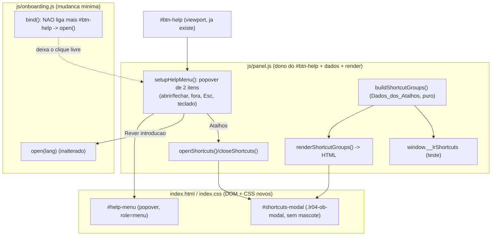

# Design Document

## Overview

Esta feature acrescenta ao LightRef um lugar para o usuario ver os atalhos de teclado, reaproveitando o Botao_de_Ajuda que ja existe. Hoje o `#btn-help` reabre o Wizard diretamente; a feature troca esse clique por um pequeno Menu_de_Ajuda de dois itens ("Rever introducao" e "Atalhos") e adiciona uma Lista_de_Atalhos (modal) no estilo visual do Wizard do Xuimzinho, listando so os atalhos reais ja presentes no codigo, agrupados por contexto.

E uma feature de **exibicao**: nao altera, adiciona nem remove nenhum comportamento de atalho real (`bindLightKeys`/`bindCompKeys` em `js/panel.js` e o arraste em `js/scene.js` continuam identicos). Nao mexe na cena 3D nem no Estado_da_Sessao restaurado (spec `update-button-wizard-and-session`, Area C): o menu e a lista sao apenas camadas visuais; abrir/fechar nao chama captura nem restauracao de sessao.

Todo o trabalho e client-side no painel CEP. **Nao ha build step:** todo codigo de producao e ES5 puro, ASCII-only, compativel com o CEF_Antigo (Chromium ~61, Photoshop 2019/2020, polyfills em `js/vendor-compat.js`) e com o CEF_Atual (Chromium 99). Sem arrow functions, `let`/`const`, classes, template literals, `Promise` nativa, `async/await`. Apenas os arquivos de teste (fast-check, rodando em Node) podem usar sintaxe moderna.

### Principio central

Reusar o que ja esta pronto e adicionar so a casca que falta:

- **Menu_de_Ajuda:** o `#btn-help` ja existe no viewport e o `onboarding.js` ja sabe abrir o Wizard (`LightRefOnboarding.open`). A parte nova e: (1) o `onboarding.js` deixa de ligar o clique do `#btn-help` ao Wizard; (2) o `panel.js` passa a ser dono desse clique, abrindo um popover de dois itens; "Rever introducao" chama `LightRefOnboarding.open(curLang)` (comportamento do Wizard inalterado) e "Atalhos" abre a Lista_de_Atalhos.
- **Lista_de_Atalhos:** reusa o padrao visual de modal/card do Wizard (`.lr04-ob-modal`/`.lr04-ob-card`) ja presente em `index.css`, sem o mascote (lista compacta com titulo). O conteudo vem de uma estrutura de dados pura (Dados_dos_Atalhos) em `panel.js`, renderizada no modal, para ficar em sincronia com os atalhos reais e ser testavel em Node.

### Achados da leitura do codigo (baseline real)

- `index.html`
  - `#btn-help` ja existe dentro de `.lr04-viewport` (irmao do `.lr04-toptools`): `<button id="btn-help" class="lr04-help" type="button" aria-label="Rever introducao" data-tooltip="Rever introducao"><i data-lucide="help-circle"></i></button>`. E um unico elemento.
  - O Wizard ja esta montado: `#onboarding-modal.lr04-ob-modal` com `.lr04-ob-card`, cabecalho (`#onboard-title`, `#step-dots`, `#onboard-close`), mascote (`#xuim-avatar-img`, `#xuim-speech-bubble`), passos `#onboard-step-0..5` e nav. Esse modal fica dentro de `.lr04-window`.
  - Padrao de dialogo generico tambem presente: `.lr04-modal[hidden] > .lr04-modalcard > header(#lr04-modal-title + [data-action=close]) + .lr04-modalbody` (usado por `openDialog`/`closeDialog` no `panel.js`).
  - Ordem de scripts no fim do `body`: `diag`, `vendor-compat`, `babylon`, `loaders`, `lucide`, `CSInterface`, `storage`, `lights`, `postfx`, `scene`, `to-photoshop`, `update`, `onboarding`, `session`, `panel`. O `onboarding.js` carrega **antes** do `panel.js`.
- `js/onboarding.js` (`window.LightRefOnboarding`)
  - `bind()` roda em `DOMContentLoaded` e, no fim, faz: `var help = $('btn-help'); if (help) help.addEventListener('click', function(){ open(lang); });` -> este e o unico ponto que precisa mudar.
  - `open(startLang)`, `maybeShow(currentLang)`, `onLanguageChosen(cb)` sao as unicas APIs publicas. `open` abre o modal independentemente de `onboardingCompleted`; `close(true)` grava `onboardingCompleted:true` + `language`. Nada mais do `onboarding.js` precisa mudar.
- `js/panel.js`
  - `DOMContentLoaded` chama, em ordem: `setupUpdates()`, `bindLightKeys()`, `bindCompKeys()`, fiacao de `scene.onXform`/`onLightShortcut`, `refreshIcons()`, o boot de sessao (Area C) e, por fim, a fiacao do Wizard (`onLanguageChosen` + `maybeShow(curLang)`) com `curLang = cfgBoot.language || 'pt'`.
  - `feedback(msg, err)` escreve na `.lr04-notice`. `refreshIcons()` recria os icones lucide. `applyLanguage(lang)` grava o idioma no config (i18n completa fora de escopo). Varias APIs puras ja sao expostas em `window` sob o guarda `typeof window !== 'undefined'`: `window.__lrStateApi`, `window.__lrColorApi`, `window.__lrCatalogApi`, `window.__lrUpdateUi`.
  - `bindLightKeys()`: `Ctrl+Shift+A` adiciona (`addLight`), `Ctrl+Shift+X` remove (`removeSelectedLight`), `Ctrl+Shift+Z` desfaz (`undoLight`), `Ctrl+Shift+1..9` seleciona a luz pelo numero (via `Digit`/`key`). Nao usa Alt para A/X/Z.
  - `bindCompKeys()`: ativo so quando `currentTab` e `pos` ou `comp` e sem campo de texto focado; `G`/`S`/`R` iniciam mover/escalar/rotacionar, `X`/`Y`/`Z` travam no eixo durante o xform, `Enter` confirma, `Esc` cancela. (A aba `comp` esta oculta na interface; os atalhos sao apresentados no contexto da aba Posicao.)
- `js/scene.js` arraste da luz (`_bindLightShortcut`/`onLightShortcut`): no `pointerdown` exige `ev.shiftKey` e botao esquerdo (`ev.button === 0`); `ev.ctrlKey && ev.altKey` -> modo `huetemp`; so `ev.ctrlKey` -> `colorint`; senao `rotate`. No `pointermove`: `rotate` muda `azimuth` (horizontal) e `elevation` (vertical); `colorint` muda so `intensity` (vertical); `huetemp` muda `color` por hue (horizontal, `_shiftHue`) e temperatura (vertical, `_shiftTemp`). Confirma exatamente as descricoes dos atalhos de arraste.
- `index.css`
  - `.lr04-ob-modal{position:fixed;inset:0;top:0;right:0;bottom:0;left:0;background:rgba(0,0,0,.85);display:flex;align-items:center;justify-content:center;z-index:10000}` e `.lr04-ob-card{...;max-width:340px;...}` ja existem (reaproveitaveis pela Lista_de_Atalhos).
  - `.lr04-help{position:absolute;top:8px;right:8px;z-index:6;width:28px;height:28px;...}`. O popover de material usa `z-index:3`; o `.lr04-modal` generico usa `z-index:9`; o Wizard usa `z-index:10000`.
  - Fallback de `inset` para o CEF_Antigo ja presente: `#lr04 .loading-overlay,#lr04 .lr04-modal,#lr04 #lf-checker,#lr04 canvas{top:0;right:0;bottom:0;left:0}`. O mesmo padrao `top/right/bottom/left:0` ja esta embutido no `.lr04-ob-modal`.
- `package.json`: `scripts.test` encadeia **29** arquivos `tests/*.js` com `&&`; `fast-check ^4.10.2` em devDependencies. Harnesses existentes: `tests/loadPanelState.js` (carrega `panel.js` real num `vm` com `window`/`document` falsos, **sem** disparar `DOMContentLoaded`, e expoe `window.__lr*Api`), `tests/loadOnboarding.js`, `tests/loadSession.js`, `tests/loadStorage.js`, `tests/loadPanelCatalog.js`.
- `MANUAL_IDENTIDADE_UI_XUIMART.md` secao 2 (padrao de modal do Wizard: overlay escuro, card `max-width:340px`, cabecalho com titulo + dots + fechar) e secao 4 (regra de identidade: textos ASCII, sem emoji). A Lista_de_Atalhos segue a secao 2 sem o mascote e respeita a secao 4.

## Architecture



### Restricoes tecnicas mantidas

- ES5 puro, ASCII-only em `.js`/`.jsx`. Edicao sempre com Python (UTF-8 sem BOM); `node --check <arquivo>` apos cada mudanca em `.js`.
- Nenhum comportamento de atalho real e tocado; `bindLightKeys`/`bindCompKeys`/arraste em `scene.js` ficam intactos (Req 7.2).
- Abrir/fechar o Menu_de_Ajuda ou a Lista_de_Atalhos nao chama captura, gravacao nem restauracao de sessao; a cena 3D e o Estado_da_Sessao restaurado nao sao tocados (Req 5.5, 5.6).
- Reuso de `.lr04-ob-modal`/`.lr04-ob-card` (Wizard), `feedback()`, `refreshIcons()` (lucide) e do padrao de exposicao `window.__lr*Api` sob o guarda `typeof window`.

---

## Components and Interfaces

### 1. Menu_de_Ajuda (popover de duas opcoes)

#### 1.1 Decisao de propriedade: quem e dono do clique do #btn-help

Hoje **dois** candidatos poderiam ligar o clique: o `onboarding.js` (que o liga em `bind()`) e o `panel.js`. Ter o `onboarding.js` abrindo o Wizard direto conflita com o requisito de abrir um menu (Req 2.1). Opcoes avaliadas:

| Opcao | Como | Veredito |
|---|---|---|
| (A) `panel.js` liga o menu e o `onboarding.js` continua ligando `open()` | Dois listeners no mesmo botao: um abre o menu, o outro abre o Wizard -> o Wizard abriria junto. Conflita com Req 2.1. | Rejeitada |
| (B) `onboarding.js` NAO liga mais `#btn-help`; `panel.js` vira o unico dono do clique | Remove so a ligacao do `#btn-help` em `onboarding.js` `bind()` (mantendo `open`/`maybeShow`/`onLanguageChosen` intactos). `panel.js` liga o `#btn-help` ao `setupHelpMenu`. | **ESCOLHIDA** |
| (C) `panel.js` chama `removeEventListener` do listener do `onboarding.js` | Nao da: o listener e uma funcao anonima inacessivel. | Inviavel |

**Decisao (B).** Mudanca minima e segura: `onboarding.js` deixa de reivindicar o `#btn-help`, e o `panel.js` concentra toda a logica do menu. O comportamento do Wizard (`open`, passos, persistencia) fica **exatamente** como esta (Req 2.2, 2.3).

#### 1.2 Mudanca em js/onboarding.js (minima)

No `bind()`, remover apenas estas duas linhas (a ultima ligacao da funcao):

```javascript
var help = $('btn-help');
if (help) help.addEventListener('click', function () { open(lang); });
```

Nenhuma outra linha muda. `window.LightRefOnboarding.open` continua publico e e o que o menu chamara. Como `onboarding.js` ja carrega antes do `panel.js`, `window.LightRefOnboarding` estara disponivel no boot do painel; mesmo assim o menu trata a ausencia (Req 2.5).

#### 1.3 Markup do popover em index.html

Inserir dentro de `.lr04-viewport`, logo apos o `#btn-help` (para herdar o posicionamento do canto superior direito do visor). Inicia escondido:

```html
<div id="help-menu" class="lr04-helpmenu" role="menu" aria-label="Ajuda" hidden>
  <button class="lr04-helpmenu-item" type="button" role="menuitem" data-help="intro">Rever introducao</button>
  <button class="lr04-helpmenu-item" type="button" role="menuitem" data-help="shortcuts">Atalhos</button>
</div>
```

Notas:
- `role="menu"` + `role="menuitem"` em botoes nativos (focaveis, acionados por Enter/Space sem codigo extra) atendem Req 6.2.
- O `#btn-help` recebe `aria-haspopup="true"` e `aria-expanded` alternado pelo JS (Req 6.1).
- Exatamente dois itens, textos PT fixos "Rever introducao" e "Atalhos" (Req 1.1, 6.4).

#### 1.4 CSS do popover (index.css)

Popover ancorado perto do `#btn-help` (topo-direita do viewport), sem cobrir o proprio botao (fica logo abaixo dele), no estilo escuro do painel. `z-index` acima do canvas/toptools e do popover de material (`z-index:3`), e abaixo do Wizard (`10000`); valor escolhido `8` (acima do `.lr04-modal` generico `9`? nao - abaixo; o popover e dispensado por clique fora/Esc e nao coexiste com o dialogo generico). Para folga, usar `z-index:7` (acima do `#btn-help` `6`, abaixo do `.lr04-modal` `9`):

```css
#lr04 .lr04-helpmenu{position:absolute;top:42px;right:8px;z-index:7;min-width:150px;
  background:#1b1f26;border:1px solid #323740;border-radius:8px;padding:4px;
  box-shadow:0 6px 20px rgba(0,0,0,.5)}
#lr04 .lr04-helpmenu[hidden]{display:none}
#lr04 .lr04-helpmenu-item{display:block;width:100%;text-align:left;font-size:11px;
  color:#c7ccd3;background:none;border:none;border-radius:6px;padding:7px 9px;cursor:pointer}
#lr04 .lr04-helpmenu-item:hover,#lr04 .lr04-helpmenu-item:focus{background:#222733;outline:none}
```

- `top:42px` deixa o menu abaixo do `#btn-help` (que fica em `top:8px;height:28px`), sem sobrepor o botao (Req 1.5).

#### 1.5 Fiacao do menu em panel.js (setupHelpMenu)

Nova funcao `setupHelpMenu()`, chamada no `DOMContentLoaded` (junto das outras `bind*`, apos `refreshIcons()`), toda ES5/ASCII:

```javascript
function setupHelpMenu() {
    var btn = document.getElementById('btn-help');
    var menu = document.getElementById('help-menu');
    if (!btn || !menu) return;
    btn.setAttribute('aria-haspopup', 'true');
    btn.setAttribute('aria-expanded', 'false');

    function openMenu() {
        menu.hidden = false;
        btn.setAttribute('aria-expanded', 'true');
        var first = menu.querySelector('.lr04-helpmenu-item');
        if (first && first.focus) first.focus();
    }
    function closeMenu() {
        if (menu.hidden) return;
        menu.hidden = true;
        btn.setAttribute('aria-expanded', 'false');
    }
    function toggleMenu() { if (menu.hidden) openMenu(); else closeMenu(); }

    btn.addEventListener('click', function (e) { e.stopPropagation(); toggleMenu(); });

    // Clique fora fecha (Req 1.3). O stopPropagation no botao evita autofechar.
    document.addEventListener('click', function (e) {
        if (menu.hidden) return;
        if (menu.contains(e.target) || e.target === btn) return;
        closeMenu();
    });
    // Esc fecha o menu (Req 1.4). Esc tambem fecha a lista (ver openShortcuts).
    document.addEventListener('keydown', function (e) {
        if (e.key === 'Escape' || e.code === 'Escape') { if (!menu.hidden) closeMenu(); }
    });

    var items = menu.querySelectorAll('.lr04-helpmenu-item');
    for (var i = 0; i < items.length; i++) {
        items[i].addEventListener('click', function (e) {
            e.stopPropagation();
            var what = this.getAttribute('data-help');
            closeMenu(); // fecha antes de executar a acao (Req 2.4)
            if (what === 'intro') {
                if (window.LightRefOnboarding && window.LightRefOnboarding.open) {
                    var cfg = {}; try { cfg = LightRefStorage.readConfig(); } catch (e2) {}
                    window.LightRefOnboarding.open(cfg.language || 'pt'); // Req 2.2
                }
            } else if (what === 'shortcuts') {
                openShortcuts(); // Req 3.1
            }
        });
    }
}
```

- Reabrir pelo botao com o menu aberto fecha o menu (toggle, Req 1.2).
- Se `window.LightRefOnboarding` faltar, "Atalhos" e o resto continuam funcionando sem erro (guarda; Req 2.5).

### 2. Lista_de_Atalhos (modal no estilo do Wizard, sem mascote)

#### 2.1 Dados_dos_Atalhos: fonte unica, pura e testavel

O conteudo da lista e definido por uma funcao pura `buildShortcutGroups()` que retorna um array de grupos; cada grupo tem um titulo e linhas `{ combo, desc }`. E determinista (sem estado, sem DOM) para ficar em sincronia com os atalhos reais e ser testavel em Node (Req 4.6, 4.7). Textos PT (Req 6.4), ASCII, sem emoji (Req 3.5, 7.1).

```javascript
function buildShortcutGroups() {
    return [
        { title: 'Luzes', rows: [
            { combo: 'Ctrl+Shift+A', desc: 'Adicionar luz' },
            { combo: 'Ctrl+Shift+X', desc: 'Remover a luz selecionada' },
            { combo: 'Ctrl+Shift+Z', desc: 'Desfazer a remocao' },
            { combo: 'Ctrl+Shift+1 a 9', desc: 'Selecionar a luz pelo numero' }
        ] },
        { title: 'Arraste no visor (segure Shift)', rows: [
            { combo: 'Shift + arrastar', desc: 'Girar a luz ativa (direcao e altura)' },
            { combo: 'Ctrl+Shift + arrastar', desc: 'Mudar so a intensidade' },
            { combo: 'Ctrl+Shift+Alt + arrastar', desc: 'Mudar a cor (horizontal) e a temperatura (vertical)' }
        ] },
        { title: 'Transformar objeto (aba Posicao)', rows: [
            { combo: 'G', desc: 'Mover' },
            { combo: 'S', desc: 'Escalar' },
            { combo: 'R', desc: 'Rotacionar' },
            { combo: 'X / Y / Z', desc: 'Travar no eixo' },
            { combo: 'Enter', desc: 'Confirmar' },
            { combo: 'Esc', desc: 'Cancelar' }
        ] }
    ];
}
```

Esses combos e descricoes casam exatamente com `bindLightKeys`/`bindCompKeys` (`panel.js`) e com o arraste de luz (`scene.js`): rotate muda azimute+altura, colorint muda so intensidade, huetemp muda cor (horizontal) e temperatura (vertical). (Req 4.3, 4.4, 4.5.)

#### 2.2 Renderizacao (pura string -> HTML)

`renderShortcutGroups(groups)` monta o HTML do corpo a partir dos dados, sem tocar nos atalhos. Escapa texto por seguranca (os dados sao fixos e ASCII, mas o escape mantem o padrao do projeto):

```javascript
function escHtml(s) { return String(s).replace(/&/g,'&amp;').replace(/</g,'&lt;').replace(/>/g,'&gt;'); }
function renderShortcutGroups(groups) {
    var html = '';
    for (var g = 0; g < groups.length; g++) {
        html += '<div class="lr04-sc-group"><h3 class="lr04-sc-title">' + escHtml(groups[g].title) + '</h3><dl class="lr04-sc-list">';
        var rows = groups[g].rows;
        for (var r = 0; r < rows.length; r++) {
            html += '<div class="lr04-sc-row"><dt class="lr04-sc-combo">' + escHtml(rows[r].combo) +
                    '</dt><dd class="lr04-sc-desc">' + escHtml(rows[r].desc) + '</dd></div>';
        }
        html += '</dl></div>';
    }
    return html;
}
```

Usar `<dl>/<dt>/<dd>` associa combo e descricao de forma acessivel para leitor de tela (Req 6.3).

#### 2.3 Markup do modal em index.html

Inserir dentro de `.lr04-window` (irmao do `#onboarding-modal`), reusando o padrao de modal do Wizard mas **sem** mascote. Inicia escondido:

```html
<div id="shortcuts-modal" class="lr04-ob-modal" role="dialog" aria-modal="true"
     aria-labelledby="shortcuts-title" style="display:none">
  <div class="lr04-ob-card lr04-sc-card">
    <header class="lr04-ob-head">
      <strong id="shortcuts-title">Atalhos do teclado</strong>
      <button id="shortcuts-close" class="lr04-ob-x" type="button" aria-label="Fechar">
        <i data-lucide="x" aria-hidden="true"></i>
      </button>
    </header>
    <div id="shortcuts-body" class="lr04-ob-body"></div>
  </div>
</div>
```

- Reusa `.lr04-ob-modal`/`.lr04-ob-card`/`.lr04-ob-head`/`.lr04-ob-x`/`.lr04-ob-body` (Estilo_do_Wizard, Req 3.2) sem o `.xuim-mascot-container` (sem mascote, Decisao (a)).
- `#shortcuts-title` da o titulo "Atalhos do teclado" (Req 3.3) e serve de `aria-labelledby` (Req 6.3).
- `#shortcuts-close` e o controle de fechar visivel (Req 5.1).

#### 2.4 CSS da lista (index.css)

So estilos de conteudo; o modal/card reusa o do Wizard. A unica diferenca de card: a lista nao precisa do `max-height` do mascote, so rolagem no corpo.

```css
#lr04 .lr04-sc-card{max-width:360px}
#lr04 .lr04-sc-group{margin:0 0 14px}
#lr04 .lr04-sc-group:last-child{margin-bottom:0}
#lr04 .lr04-sc-title{font-size:11px;color:#de2246;margin:0 0 6px;font-weight:600;text-transform:uppercase;letter-spacing:.4px}
#lr04 .lr04-sc-list{margin:0}
#lr04 .lr04-sc-row{display:grid;grid-template-columns:minmax(120px,auto) 1fr;gap:10px;align-items:baseline;padding:4px 0;border-top:1px solid #2a2f38}
#lr04 .lr04-sc-row:first-child{border-top:none}
#lr04 .lr04-sc-combo{margin:0;font-size:11px;color:#e0e0e0;font-weight:600;white-space:nowrap}
#lr04 .lr04-sc-desc{margin:0;font-size:11px;color:#b7bcc4;line-height:1.4}
```

O fallback de `inset` para o CEF_Antigo ja esta embutido no `.lr04-ob-modal` reusado (`top/right/bottom/left:0`), entao o modal fica em tela cheia tambem no Chromium ~61 (Req 7.1).

#### 2.5 Abrir/fechar (openShortcuts/closeShortcuts) em panel.js

```javascript
function openShortcuts() {
    var modal = document.getElementById('shortcuts-modal');
    var body = document.getElementById('shortcuts-body');
    if (!modal || !body) return;
    body.innerHTML = renderShortcutGroups(buildShortcutGroups());
    modal.style.display = 'flex';
    refreshIcons(); // icone do botao fechar
    var cls = document.getElementById('shortcuts-close');
    if (cls && cls.focus) cls.focus(); // foco no fechar para navegacao por teclado (Req 6.3)
}
function closeShortcuts() {
    var modal = document.getElementById('shortcuts-modal');
    if (modal) modal.style.display = 'none';
}
function setupShortcutsModal() {
    var modal = document.getElementById('shortcuts-modal');
    if (!modal) return;
    var cls = document.getElementById('shortcuts-close');
    if (cls) cls.addEventListener('click', closeShortcuts);          // Req 5.2
    // Clique fora do card (no overlay) fecha (Req 5.3).
    modal.addEventListener('click', function (e) { if (e.target === modal) closeShortcuts(); });
    // Esc fecha quando a lista esta visivel (Req 5.4).
    document.addEventListener('keydown', function (e) {
        if ((e.key === 'Escape' || e.code === 'Escape') && modal.style.display !== 'none') closeShortcuts();
    });
}
```

- `openShortcuts`/`closeShortcuts` so mexem no `display` do overlay e no corpo; **nao** chamam `scene.*` nem `LightRefSession.*`, logo a cena e o Estado_da_Sessao ficam inalterados (Req 5.5, 5.6).
- `setupHelpMenu()` e `setupShortcutsModal()` sao chamados no `DOMContentLoaded`.

#### 2.6 Exposicao para teste (window.__lrShortcuts)

No fim do IIFE do `panel.js`, junto do bloco que ja expoe `window.__lrStateApi`/`__lrColorApi`, sob o mesmo guarda:

```javascript
try {
    if (typeof window !== 'undefined' && window) {
        window.__lrShortcuts = { buildShortcutGroups: buildShortcutGroups, renderShortcutGroups: renderShortcutGroups };
    }
} catch (e) {}
```

Assim o harness `tests/loadPanelState.js` (que carrega `panel.js` sem disparar `DOMContentLoaded`) tem acesso aos dados e ao render puros.

### 3. Idioma

Os rotulos do menu ("Rever introducao", "Atalhos") e as descricoes dos atalhos ficam em Portugues fixo (Decisao (c), Req 6.4). "Rever introducao" repassa `cfg.language || 'pt'` para `LightRefOnboarding.open`, entao o Wizard segue respeitando o idioma ja escolhido, sem i18n nova nesta feature (Req 6.5: a traducao completa continua fora de escopo).

---

## Correctness Properties

*A property is a characteristic or behavior that should hold true across all valid executions of a system-essentially, a formal statement about what the system should do. Properties serve as the bridge between human-readable specifications and machine-verifiable correctness guarantees.*

Esta feature e majoritariamente DOM/CSS + fiacao de eventos, cuja verificacao real exige o Photoshop (manual). A unica logica que varia de forma util e testavel em Node e os **Dados_dos_Atalhos** e sua **montagem** (`buildShortcutGroups`/`renderShortcutGroups`), que sao puros. Para essa logica valem as propriedades abaixo; a abertura/fechamento de menu e modal (que dependem de `DOMContentLoaded` e de eventos de ponteiro) ficam como verificacao manual no Photoshop (ver Testing Strategy) e como smokes de presenca de DOM.

### Property 1: Grupos e combos esperados

*Para qualquer* execucao, `buildShortcutGroups()` retorna exatamente tres grupos, com titulos "Luzes", "Arraste no visor (segure Shift)" e "Transformar objeto (aba Posicao)", nas contagens de linhas 4, 3 e 6 respectivamente, e os combos de cada grupo sao exatamente os atalhos reais definidos (Ctrl+Shift+A/X/Z, Ctrl+Shift+1 a 9; Shift / Ctrl+Shift / Ctrl+Shift+Alt arrastar; G/S/R, X/Y/Z, Enter, Esc).

**Validates: Requirements 4.1, 4.3, 4.4, 4.5, 4.7**

### Property 2: Linhas sao texto ASCII nao vazio e sem emoji

*Para qualquer* linha de qualquer grupo de `buildShortcutGroups()`, `combo` e `desc` sao strings nao vazias compostas somente por caracteres ASCII imprimiveis (nenhum ponto de codigo fora de 0x20..0x7E, logo nenhum emoji).

**Validates: Requirements 3.5, 7.1**

### Property 3: buildShortcutGroups e determinista

*Para qualquer* par de chamadas, `buildShortcutGroups()` produz estruturas profundamente iguais (mesmos titulos, mesma ordem, mesmas linhas), confirmando que os dados sao puros e estaveis (sem dependencia de estado externo).

**Validates: Requirements 4.6**

### Property 4: Renderizacao contem toda linha de dados

*Para qualquer* conjunto de grupos retornado por `buildShortcutGroups()`, o HTML de `renderShortcutGroups(groups)` contem o texto (escapado) de cada `title`, cada `combo` e cada `desc`, e nao introduz nenhuma linha alem das presentes nos dados.

**Validates: Requirements 4.2, 4.7**

## Error Handling

- `#btn-help` ou `#help-menu` ausentes: `setupHelpMenu()` retorna cedo sem erro; o painel segue normal.
- `window.LightRefOnboarding` ausente ao escolher "Rever introducao": guarda `if (window.LightRefOnboarding && window.LightRefOnboarding.open)`; nenhum erro, "Atalhos" continua funcionando (Req 2.5).
- `#shortcuts-modal`/`#shortcuts-body` ausentes: `openShortcuts()`/`setupShortcutsModal()` retornam cedo sem erro.
- Esc com nada aberto: os handlers so agem quando o alvo (menu ou modal) esta visivel; sem efeito colateral na cena.
- Abrir/fechar menu ou lista: nenhuma chamada a `scene.*` ou `LightRefSession.*`; o Estado_da_Sessao restaurado nunca e gravado nem limpo por esta feature (Req 5.5, 5.6).
- `LightRefStorage.readConfig()` lanca ao resolver o idioma: envolto em `try/catch`, cai para `'pt'`.

## Testing Strategy

Abordagem dupla, no padrao do projeto: **testes de propriedade** (fast-check, >= 100 iteracoes) para a logica pura (Dados_dos_Atalhos e montagem), e **testes de exemplo/smoke** para presenca de API/DOM. A logica de abrir/fechar (menu/modal) depende de `DOMContentLoaded` e de eventos de ponteiro que o harness Node nao dispara; essa parte e coberta pela **verificacao manual no Photoshop** (Req 7.4).

### Restricoes de execucao

- ES5-only, ASCII-only em `.js`/`.jsx`; editar sempre com Python (UTF-8 sem BOM); rodar `node --check <arquivo>` apos cada mudanca em `.js`.
- `npm test` pode falhar neste terminal; os testes sao executados pelo runner Node que grava o resultado num arquivo (no estilo dos atuais). Hoje ha **29 testes** passando; os novos sao **registrados no script `test` do `package.json`** (acrescentados a cadeia `&&`), sem quebrar os existentes (Req 7.3).
- `fast-check` ja esta em devDependencies. Cada teste de propriedade roda **>= 100 iteracoes** e e etiquetado com `Feature: shortcuts-help, Property N: <texto>`.

### Harness reaproveitado

- `tests/loadPanelState.js` carrega o `panel.js` real num `vm` com `window`/`document` falsos, **sem** disparar `DOMContentLoaded`, e expoe `window.__lr*Api`. Apos esta feature, tambem expora `window.__lrShortcuts` ({ `buildShortcutGroups`, `renderShortcutGroups` }). Nenhum harness novo e necessario.

### Mapa propriedade -> teste (property-based, >= 100 iteracoes)

| Propriedade | Arquivo de teste (sugestao) | Observacao |
|---|---|---|
| P1 Grupos e combos esperados | `tests/shortcutsData.property.test.js` | confere 3 grupos, titulos, contagens 4/3/6 e combos exatos |
| P2 ASCII nao vazio sem emoji | `tests/shortcutsAscii.property.test.js` | varre combo/desc por codepoints fora de 0x20..0x7E |
| P3 Determinismo | `tests/shortcutsDeterministic.property.test.js` | duas chamadas -> igualdade profunda |
| P4 Render contem as linhas | `tests/shortcutsRender.property.test.js` | HTML contem title/combo/desc de cada linha |

Observacao: P1 e P3 operam sobre uma estrutura fixa; o "para qualquer" se materializa rodando a verificacao em >= 100 iteracoes (fast-check gera indices/ordens de checagem ou simplesmente repete a amostragem), mantendo o formato property-based do projeto. P2 e P4 ganham forca gerando entradas (por exemplo, selecionando aleatoriamente qual linha inspecionar) sobre os dados reais.

### Examples / smokes (nao-propriedade)

- `tests/shortcutsApi.smoke.test.js` - `window.__lrShortcuts` existe e expoe `buildShortcutGroups`/`renderShortcutGroups` apos carregar `panel.js` pelo harness (Req 4.6); `renderShortcutGroups([])` retorna string vazia; `renderShortcutGroups(buildShortcutGroups())` retorna string nao vazia (Req 4.2).

### Verificacao manual no Photoshop (Req 7.4 - o usuario executa)

1. Clicar no `#btn-help` e confirmar que aparece o Menu_de_Ajuda com exatamente "Rever introducao" e "Atalhos", abaixo do botao, sem cobri-lo.
2. Clicar de novo no `#btn-help` e confirmar que o menu fecha (toggle); clicar fora e confirmar que fecha; pressionar Esc e confirmar que fecha.
3. Selecionar "Rever introducao" e confirmar que o Wizard abre como antes.
4. Selecionar "Atalhos" e confirmar que a Lista_de_Atalhos aparece no estilo do Wizard (sem mascote), com titulo "Atalhos do teclado", os tres grupos e os atalhos reais.
5. Fechar a Lista_de_Atalhos pelo botao de fechar, por clique fora do card e por Esc.
6. Navegar menu e lista so pelo teclado (Tab/Shift+Tab, Enter/Space para acionar, Esc para fechar).
7. Confirmar que a cena 3D e a sessao restaurada permanecem iguais depois de abrir e fechar o menu e a lista (nenhum flash do modelo, nenhuma luz a mais, camera inalterada).
8. Confirmar os comportamentos no Photoshop 2019, 2020 e nas versoes atuais.

## Decisoes para o usuario (revisao)

Todas confirmadas antes do design (defaults aprovados):

1. **Mascote na lista:** sem mascote; lista compacta com titulo no estilo do card do Wizard (Decisao (a)).
2. **Menu x acao direta:** o `#btn-help` passa a abrir um menu de dois itens e nao reabre mais o Wizard diretamente (Decisao (b)).
3. **Idioma:** rotulos e descricoes em Portugues; "Rever introducao" repassa o idioma atual ao Wizard (Decisao (c)).
