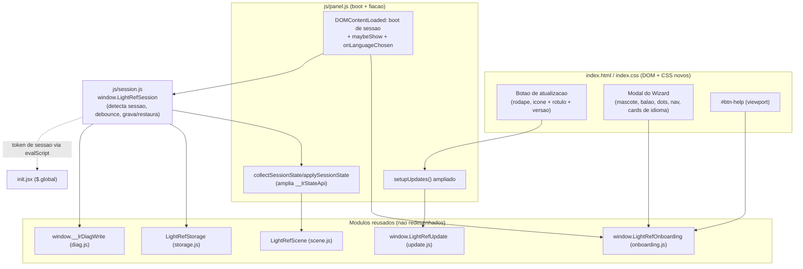
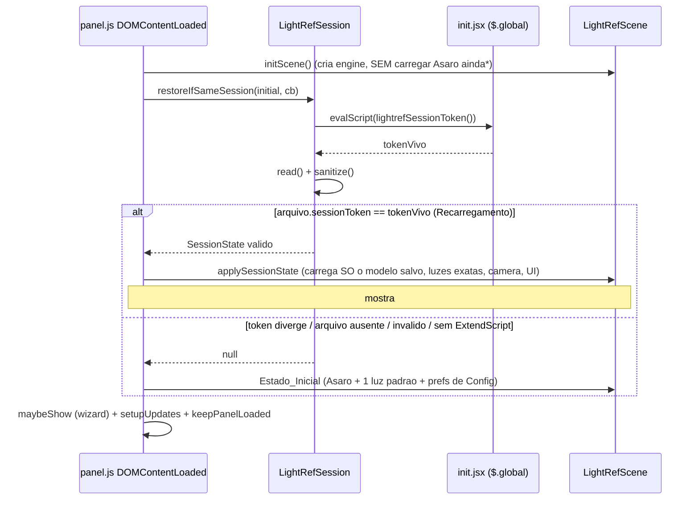

# Design Document

## Overview

Esta feature liga tres melhorias que ja existem *em parte* no codigo do LightRef mas que estao incompletas ou desligadas, e adiciona o que falta sem redesenhar os sistemas existentes:

- **Area A - Botao de atualizacao:** reaproveitar `window.LightRefUpdate` (`js/update.js`) e expor um controle visivel (icone + rotulo) no rodape que dispara a Verificacao_Manual (`check(true)`), mostra os estados (verificando / ja atualizado / banner / falha) e exibe a Versao_Instalada (`LightRefUpdate.VERSION`). O sistema de update **nao** e redesenhado.
- **Area B - Wizard (onboarding Xuimzinho):** `js/onboarding.js` ja implementa toda a logica (`window.LightRefOnboarding.maybeShow/open/onLanguageChosen`, 6 passos 0..5, animacao do mascote, `writeConfig` de `onboardingCompleted`/`language`). O gap e puramente de integracao: `index.html` nao carrega `js/onboarding.js`, nao tem a marcacao do modal e nao tem `#btn-help`; `panel.js` nunca chama `maybeShow()` nem registra `onLanguageChosen`. O design supre exatamente o DOM que o `onboarding.js` espera e a fiacao no boot, com **mudanca minima** de JS existente.
- **Area C - Persistencia da sessao:** o `com.adobe.PhotoshopPersistent` (`js/to-photoshop.js keepPanelLoaded()`) **nao e confiavel** em todas as versoes. O design adota uma persistencia propria de **Estado_da_Sessao** em disco (via `LightRefStorage`), com **deteccao de sessao** que distingue Recarregamento_do_Painel (mesma Sessao_do_Photoshop) de nova Sessao_do_Photoshop, funcionando **independentemente** de o Host manter ou nao o painel carregado. Esta Area substitui o rascunho `panel-session-persistence`.

Todo o trabalho e client-side no painel CEP. **Nao ha build step:** todo codigo e ES5 puro, ASCII-only, compativel com o CEF_Antigo (Chromium ~61, Photoshop 2019/2020, polyfills em `js/vendor-compat.js`) e com o CEF_Atual (Chromium 99). Sem arrow functions, `let`/`const`, classes, template literals, `Promise` nativa, `async/await`. Persistencia por `LightRefStorage` (escrita atomica `tmp` + `rename`, `writeConfig` faz merge e nao apaga chaves de outra origem).

### Principio central

Reusar o que ja esta pronto e adicionar so a casca que falta:

- **A** reusa `LightRefUpdate` inteiro; a parte nova e um controle de UI + um pequeno `setupUpdates()` ampliado + (opcional, decisao de design) um cache-buster no `fetchJson`.
- **B** reusa `LightRefOnboarding` inteiro; a parte nova e DOM + CSS + 3 linhas de fiacao no boot.
- **C** reusa `collectSceneState`/`applySceneState` (ja extraidos e testaveis via `window.__lrStateApi`); a parte nova e: ampliar o estado (camera, luz selecionada, "Mostrar fundo do HDR", pagina/aba/toggles), um modulo de **sessao** (`LightRefSession`) para capturar/validar/gravar/restaurar com debounce, um par `getCameraState`/`setCameraState` em `scene.js`, deteccao de sessao via marcador na engine ExtendScript, e pausa do render loop quando oculto.

### Achados da leitura do codigo (baseline real)

- `index.html`
  - Rodape atual: `<footer class="lr04-footer"><span class="lr04-brand">LightRef</span><nav ...>3D/Biblioteca/Cenas</nav><button data-action="collapse">...</button></footer>`. O grid do footer e `1fr auto 1fr` (marca a esquerda, nav no centro, botao a direita).
  - Padrao de dialogo ja presente: `.lr04-modal > .lr04-modalcard > header(#lr04-modal-title + [data-action=close]) + .lr04-modalbody`.
  - Ordem de scripts no fim do `body`: `diag`, `vendor-compat`, `babylon`, `loaders`, `lucide`, `CSInterface`, `storage`, `lights`, `postfx`, `scene`, `to-photoshop`, `update`, `panel`. **Nao** carrega `onboarding.js`. **Nao** ha `#onboarding-modal` nem `#btn-help`.
- `js/update.js` (`window.LightRefUpdate`)
  - `VERSION` = `LIGHTREF_VERSION` (`'0.6.0'`). `compareVersions(a,b)` (semver por 3 segmentos). `check(manual)`: faz `fetchJson(VERSION_URL)`; em erro, se `manual` chama `LightRefToast('Nao foi possivel verificar atualizacoes.')`; se `remota > instalada` chama `showBanner(info)`; senao, se `manual`, `LightRefToast('Voce ja esta na versao mais recente (x.y.z).')`.
  - `fetchJson(url, cb)` usa `https.get` (Node) com fallback `fetch`. **Sem cache-buster** na URL. `showBanner` injeta `#lf-update-banner` em `#lightref` ou `body`. O botao "Baixar atualizacao" chama `openExternal(url)` (`cep.util.openURLInDefaultBrowser` / `CSInterface.openURLInDefaultBrowser`).
- `js/panel.js`
  - `setupUpdates()`: liga o clique da `.lr04-brand` a `feedback('Verificando atualizacoes...')` + `LightRefUpdate.check(true)`; agenda `check(false)` apos 1500 ms. `footerLabel()` monta `'LightRef v' + VERSION`. `window.LightRefToast = feedback`.
  - `collectSceneState(sc, modelValue)` / `applySceneState(sc, state, opts)` sao **puras** (so dependem do objeto `scene` e de `opts`), expostas em `window.__lrStateApi`. Estado atual (`schema: 2`): `model, rotation{yaw,pitch,roll}, offset{x,y,z}, scaleMult, background{transparent,color}, lights[], fx, focal, projection, material, materialParams, formColor, environment, envIntensity`. `applySceneState` ja carrega o modelo primeiro, trata falha de modelo (chama `applyRest` no `onFail`) e faz fallback item-a-item (`if (campo != null)`), nunca duplica luzes (remove todas e re-adiciona).
  - Estado **que ainda nao esta no Estado_Completo**: Estado_da_Camera (orbita), luz selecionada (`selectedLightId`), "Mostrar fundo do HDR" (`#ck-envbg` + `scene.setEnvBackgroundVisible`), pagina ativa (`currentPage`), aba ativa (`currentTab`), toggles do visor (`floorOn`/`guidesOn`/`refOn`, classes `.lr04-reference`/`.lr04-collapsed` no `stateHost()`), popover de Material (classe `.lr04-matopen`), gaveta Ambiente/HDR (`#env-drawer-body[hidden]`).
  - Boot (`DOMContentLoaded`): `initScene` carrega **sempre** o Asaro (`loadModelSafe(MODELS[0].v)`) e adiciona **uma** luz padrao. No fim chama `keepPanelLoaded()`. Ha `loadToken` que descarta loads antigos (resolve Req 15.3). `showLoading(on)` controla `#loading-overlay`.
- `js/scene.js`
  - `this.camera` e um `BABYLON.ArcRotateCamera` (`alpha`, `beta`, `radius`, `target` Vector3). `engine.runRenderLoop(function(){ self.scene.render(); })` roda **sempre** (sem pausa). Existe `_resizePoll = setInterval(..., 500)`.
  - Ambiente/HDR: `getEnvironment()`, `setEnvironment(url, {showBackground})`, `getEnvIntensity()`, `setEnvIntensity(v)`, `setEnvBackgroundVisible(on)` (liga/desliga so o `_skybox`). **Nao** ha getter/setter da orbita da camera.
- `js/storage.js`
  - `readConfig()`/`writeConfig(cfg)` (merge). `writeJSONAtomic`. `stripBOM`. `isSafeKey` barra `__proto__`/`constructor`/`prototype`. Novos helpers de categoria/gaveta ja existem (feature anterior).
- `js/to-photoshop.js`
  - `keepPanelLoaded()` dispara `com.adobe.PhotoshopPersistent`. `appDataDir()` resolve `%APPDATA%\LightRef`. `pickColor`/`placeAsLayer` usam `evalScript`.
- `js/onboarding.js`
  - Espera no DOM: `#onboarding-modal`, `#onboard-title`, `#onboard-step-0..5`, `#step-dots` (o JS cria `#ob-dot-0..5`), `#xuim-speech-bubble`, `#xuim-avatar-img`, `#onboard-prev`, `#onboard-next`, `#onboard-finish`, `#onboard-close`, `.lang-card[data-lang]`, e as classes de texto `lang-back`/`lang-next`/`lang-start` e `lang-ob-1..5`. Opcionalmente `#btn-help` (liga sozinho se existir).
  - 6 passos: 0 = idioma, 1..4 = recursos, 5 = encerramento ("Voce esta pronto!") **sem doacao**. `close(true)` grava `onboardingCompleted:true` + `language`.
- `js/diag.js`: `window.__lrDiagWrite()` grava `%APPDATA%\LightRef\diag.json`; usamos para registrar falhas de sessao (Req 15.5).
- `package.json`: `scripts.test` roda ~18 arquivos `tests/*.js` em sequencia com `&&`; `fast-check ^4.10.2` em devDependencies. Harness `tests/loadPanelState.js` carrega `panel.js` num `vm` com `window`/`document` falsos (sem disparar `DOMContentLoaded`) e um `makeFakeScene`.
- `MANUAL_IDENTIDADE_UI_XUIMART.md` secao 2: modal full-panel; `.xuim-mascot-container` + `.xuim-avatar-img` (circular, borda `#de2246`, `scaleX(-1)`); `.speech-bubble-box`; `.step-dots .dot` com `.active`(`#de2246`)/`.completed`(`#22c55e`); `.lang-cards-group`/`.lang-card.selected`; `.onboard-feature-box`; padrao de modal `position:fixed; inset:0; background:rgba(0,0,0,.85); z-index:10000` e `max-width:340px`. A tabela generica da secao 2 inclui um passo de doacao (passo 9), mas o `onboarding.js` do LightRef **nao tem** passo de doacao (confirma a Decisao de "sem doacao").

## Architecture



### Restricoes tecnicas mantidas

- ES5 puro, ASCII-only em `.js`/`.jsx`. Edicao sempre com Python (UTF-8 sem BOM); `node --check` apos cada mudanca.
- Persistencia so por `LightRefStorage` (atomica). O Estado_da_Sessao e um payload **separado e versionado** (JSON puro); nao mexe em `scenes.json`, `models_index.json`, `models/`, categorias, `drawerState`, `modelXforms` nem demais chaves de Config (exceto a propria chave de sessao e `onboardingCompleted`/`language` do onboarding).
- Reuso de `.lr04-modal`, `feedback()` (`.lr04-notice`), `refreshIcons()` (lucide) e dos getters/setters de `LightRefScene`.

---

## Components and Interfaces

### Area A - Botao de atualizacao

#### A.1 Objetivo e reuso

Nao redesenhar nada do `LightRefUpdate`. Expor um controle claro no rodape que: (1) dispara `check(true)`, (2) mostra "verificando", (3) deixa os tres desfechos a cargo do proprio `LightRefUpdate` (toast "ja atualizado", `#lf-update-banner`, toast de falha), e (4) exibe a Versao_Instalada.

#### A.2 Markup a adicionar em index.html (rodape)

O footer passa a ter um bloco de atualizacao antes/junto da `.lr04-brand`. O grid do footer continua `1fr auto 1fr`; o bloco de update vai na primeira celula (a esquerda), junto da marca:

```html
<footer class="lr04-footer">
  <div class="lr04-footleft">
    <button id="btn-update" class="lr04-updbtn" type="button"
            aria-label="Verificar atualizacoes" data-tooltip="Verificar atualizacoes">
      <i data-lucide="refresh-cw" aria-hidden="true"></i>
      <span class="lr04-updlabel">Atualizar</span>
    </button>
    <span class="lr04-brand" title="LightRef">LightRef <span class="lr04-ver" id="lr-version">v0.6.0</span></span>
  </div>
  <nav aria-label="Navegacao principal"> ... 3D / Biblioteca / Cenas ... </nav>
  <button data-action="collapse" ...>...</button>
</footer>
```

Notas:
- O icone usa lucide `refresh-cw` (ja ha `lucide.min.js` carregado; `refreshIcons()` cria os icones). Alternativa aceitavel: `download-cloud`.
- `#lr-version` e preenchido por JS a partir de `LightRefUpdate.VERSION` (nao hardcode; o `v0.6.0` no HTML e so um placeholder). (Req 3.1, 3.2.)
- A `.lr04-brand` permanece como gatilho secundario (Req 1.4).

#### A.3 CSS (index.css, estilo do rodape existente)

```css
#lr04 .lr04-footleft{display:flex;align-items:center;gap:8px;min-width:0}
#lr04 .lr04-updbtn{display:inline-flex;align-items:center;gap:5px;font-size:11px;
  color:#c7ccd3;background:#1b1f26;border:1px solid #323740;border-radius:7px;
  padding:4px 8px;cursor:pointer}
#lr04 .lr04-updbtn:hover{border-color:#4a515b;background:#222733}
#lr04 .lr04-updbtn i{width:13px;height:13px}
#lr04 .lr04-updbtn.is-checking i{animation:lr-spin 1s linear infinite}
#lr04 .lr04-updlabel{line-height:1}
#lr04 .lr04-ver{color:#717780}
@keyframes lr-spin{to{transform:rotate(360deg)}}
/* no media query estreito, esconde so o rotulo, mantem o icone */
@media (max-width:420px){#lr04 .lr04-updlabel{display:none}}
```

#### A.4 Fiacao em panel.js (setupUpdates ampliado)

`setupUpdates()` passa a:
1. Preencher `#lr-version` com `LightRefUpdate.VERSION` via um helper `installedVersionLabel()` (Req 3.1/3.2); se `LightRefUpdate` estiver ausente, usa um fallback e nao lanca (Req 3.3).
2. Ligar `#btn-update` ao fluxo manual: ao clicar, aplica `is-checking` no botao, chama `feedback('Verificando atualizacoes...')` (Req 2.1) e `LightRefUpdate.check(true)`; remove `is-checking` apos um curto atraso (o `check` e assincrono e os desfechos vem via `LightRefToast`/banner, entao a classe e so visual).
3. Manter o clique da `.lr04-brand` disparando `check(true)` (Req 1.4) e o `check(false)` agendado ~1.5 s (Req 4.1).

Esboco (ES5):

```javascript
function installedVersionLabel() {
    var v = (window.LightRefUpdate && window.LightRefUpdate.VERSION) ? window.LightRefUpdate.VERSION : null;
    return v ? ('v' + v) : 'v?';            // fallback sem erro (Req 3.3)
}
function runManualUpdateCheck(btn) {
    if (btn) btn.classList.add('is-checking');
    feedback('Verificando atualizacoes...');          // Req 2.1
    if (window.LightRefUpdate) window.LightRefUpdate.check(true);  // Req 1.3 / 2.2-2.4
    setTimeout(function(){ if (btn) btn.classList.remove('is-checking'); }, 1200);
}
function setupUpdates() {
    var ver = document.getElementById('lr-version');
    if (ver) ver.textContent = installedVersionLabel();          // Req 3.1/3.2/3.3
    var ub = document.getElementById('btn-update');
    if (ub) ub.addEventListener('click', function(){ runManualUpdateCheck(ub); });
    var brand = document.querySelector('.lr04-brand');           // gatilho secundario (Req 1.4)
    if (brand) { brand.style.cursor = 'pointer'; brand.addEventListener('click', function(){ runManualUpdateCheck(ub); }); }
    setTimeout(function(){ if (window.LightRefUpdate) window.LightRefUpdate.check(false); }, 1500); // Req 4.1
}
```

Os desfechos 2.2/2.3/2.4/4.2/4.3 continuam decididos dentro de `LightRefUpdate.check` (nao reimplementamos a decisao). A logica pura testavel (abaixo) e a **funcao de decisao** `decideUpdateOutcome(remote, installed, manual)`, extraida de `check` para permitir testes sem rede (ver Testing Strategy); `check` passa a chamar essa funcao e aplicar o efeito.

#### A.5 Versao: fonte unica para leitura, tres lugares para bump

A Versao_Instalada e **lida** apenas de `LightRefUpdate.VERSION`. A string da versao vive em tres arquivos que o mantenedor bumpa a cada release (fora do escopo automatizar): `js/update.js` (`LIGHTREF_VERSION`), `package.json` (`version`) e `CSXS/manifest.xml` (`ExtensionBundleVersion` e `Extension Version`). O botao nunca escreve versao; so le `LightRefUpdate.VERSION`.

#### A.6 Cache do version.json (decisao de design)

`fetchJson` busca sempre a mesma URL (`version.json`). Proxies/CDN podem servir uma copia em cache e o usuario deixar de ver uma versao nova por horas. **Recomendacao:** acrescentar um cache-buster `?t=<timestamp>` na URL dentro de `fetchJson` (uma linha, baixo risco, nao muda o contrato). Fica como decisao do mantenedor; se adotado, aplica-se igualmente ao `check(true)` e ao `check(false)`.

### Area B - Wizard (onboarding Xuimzinho)

#### B.1 Decisao: reusar onboarding.js como esta e fornecer o DOM que ele espera

O `onboarding.js` ja faz tudo (passos, dots, animacao, idioma ao vivo, persistencia). O caminho de **menor mudanca** e: (1) carregar o script, (2) adicionar o DOM exato que ele consulta por id/classe, (3) adicionar `#btn-help`, (4) fiar `maybeShow`/`onLanguageChosen` no boot. Nenhuma reescrita de `onboarding.js`.

Confirmacoes com o codigo:
- Sao **6 passos (0..5)**; o passo 5 e "Voce esta pronto!" **sem doacao** nem links de doacao -> casa com a Decisao "sem doacao". Nenhuma edicao de passos e necessaria.
- O passo 0 e o idioma; `open(startLang)` chama `selectLangCard(lang)` antes de `goToStep(0)` -> o idioma inicia **pre-selecionado** a partir do que passamos (Req 6.4).

**Pequenas edicoes opcionais em onboarding.js** (so se a revisao pedir), todas ASCII/ES5:
- Trocar o texto do balao do passo 5 para remover a frase de "apoiar o projeto / cafezinho" e deixar so o encerramento amigavel (hoje o passo 5 do `speech` diz "Se quiser apoiar o projeto, todo cafezinho ajuda"). Isso **nao** e um passo nem um link de doacao, mas para ficar 100% alinhado com a Decisao "sem doacao" recomenda-se reescrever essa frase para algo como "Pronto! Qualquer duvida, reabra este guia pelo botao de ajuda." A reescrita e de **conteudo** (string), nao de estrutura.

#### B.2 Markup do modal a adicionar em index.html

Inserir dentro de `.lr04-window` (irmao de `.lr04-modal` existente), seguindo o padrao de modal da secao 2 do Manual. Ids/classes **exatamente** como o `onboarding.js` espera:

```html
<div id="onboarding-modal" class="lr04-ob-modal" style="display:none">
  <div class="lr04-ob-card">
    <header class="lr04-ob-head">
      <strong id="onboard-title">Bem-vindo ao LightRef</strong>
      <div id="step-dots" class="step-dots" aria-hidden="true"></div>
      <button id="onboard-close" class="lr04-ob-x" type="button" aria-label="Fechar">
        <i data-lucide="x" aria-hidden="true"></i>
      </button>
    </header>

    <div class="xuim-mascot-container">
      
      <div id="xuim-speech-bubble" class="speech-bubble-box"></div>
    </div>

    <div class="lr04-ob-body">
      <!-- Passo 0: idioma -->
      <section id="onboard-step-0" class="lr04-ob-step">
        <div class="lang-cards-group">
          <button class="lang-card" data-lang="pt" type="button"><span class="lang-name">Portugues</span></button>
          <button class="lang-card" data-lang="en" type="button"><span class="lang-name">English</span></button>
        </div>
      </section>
      <!-- Passos 1..4: recursos (texto preenchido por onboarding.js nas classes lang-ob-N) -->
      <section id="onboard-step-1" class="lr04-ob-step" style="display:none"><div class="onboard-feature-box lang-ob-1"></div></section>
      <section id="onboard-step-2" class="lr04-ob-step" style="display:none"><div class="onboard-feature-box lang-ob-2"></div></section>
      <section id="onboard-step-3" class="lr04-ob-step" style="display:none"><div class="onboard-feature-box lang-ob-3"></div></section>
      <section id="onboard-step-4" class="lr04-ob-step" style="display:none"><div class="onboard-feature-box lang-ob-4"></div></section>
      <!-- Passo 5: encerramento (sem doacao) -->
      <section id="onboard-step-5" class="lr04-ob-step" style="display:none"><div class="onboard-feature-box lang-ob-5"></div></section>
    </div>

    <footer class="lr04-ob-nav">
      <button id="onboard-prev" class="lr04-ob-btn lang-back" type="button">Voltar</button>
      <button id="onboard-next" class="lr04-ob-btn lr04-ob-primary lang-next" type="button">Proximo</button>
      <button id="onboard-finish" class="lr04-ob-btn lr04-ob-primary lang-start" type="button" style="display:none">Comecar!</button>
    </footer>
  </div>
</div>
```

Pontos de aderencia ao `onboarding.js`:
- `buildDots()` cria `#ob-dot-0..5` dentro de `#step-dots` (so precisamos do container vazio).
- `applyTexts()` escreve nos elementos de classe `lang-back`/`lang-next`/`lang-start` e `lang-ob-1..5` (por isso essas classes nos botoes de nav e nas feature boxes).
- `goToStep(n)` mostra/esconde `#onboard-step-N` (usa `style.display`), seta o balao `#xuim-speech-bubble` e alterna `#onboard-next`/`#onboard-finish`.
- `selectLangCard(l)` alterna `.selected` nos `.lang-card[data-lang]`.
- O conteudo textual dos recursos vem das strings `ob1..ob5` do `onboarding.js` (recursos reais: cena 3D no Photoshop, escolher/importar modelo, luzes com direcao/altura/cor/intensidade, filtros em Ajustes, salvar cenas, enviar como camada) -> Req 7.1.

#### B.3 CSS do wizard (index.css, reusa o padrao de modal)

```css
#lr04 .lr04-ob-modal{position:fixed;inset:0;top:0;right:0;bottom:0;left:0;
  background:rgba(0,0,0,.85);display:flex;align-items:center;justify-content:center;z-index:10000}
#lr04 .lr04-ob-card{background:#1e1e24;border:1px solid #444;border-radius:10px;
  width:100%;max-width:340px;max-height:96vh;display:flex;flex-direction:column;overflow:hidden;
  box-shadow:0 8px 32px rgba(0,0,0,.6)}
#lr04 .lr04-ob-head{display:flex;align-items:center;gap:8px;padding:10px 12px;border-bottom:1px solid #333}
#lr04 .lr04-ob-head #onboard-title{flex:0 0 auto;font-size:12px}
#lr04 .lr04-ob-head .step-dots{flex:1;justify-content:center}
#lr04 .step-dots{display:flex;gap:6px}
#lr04 .step-dots .dot{width:8px;height:8px;border-radius:50%;background:#3a3a4a;transition:background .2s}
#lr04 .step-dots .dot.active{background:#de2246}
#lr04 .step-dots .dot.completed{background:#22c55e}
#lr04 .lr04-ob-x{background:none;border:none;color:#aaa;cursor:pointer}
#lr04 .xuim-mascot-container{display:flex;align-items:center;gap:10px;padding:12px;min-height:70px}
#lr04 .xuim-avatar-img{width:56px;height:56px;border-radius:50%;object-fit:cover;border:2px solid #de2246;flex-shrink:0}
#lr04 .speech-bubble-box{background:#2c2c36;color:#f0f0f0;font-size:11px;line-height:1.5;
  padding:8px 12px;border-radius:8px;border:1px solid #3c3c48;flex:1}
#lr04 .lr04-ob-body{padding:0 12px 12px;overflow:auto}
#lr04 .onboard-feature-box{background:#1e1e28;border:1px solid #3c3c48;border-radius:8px;padding:10px 12px;font-size:11px;line-height:1.5}
#lr04 .lang-cards-group{display:flex;gap:10px;justify-content:center;margin-top:8px}
#lr04 .lang-card{flex:1;background:#1c1c24;border:2px solid #3a3a4a;border-radius:10px;padding:12px;text-align:center;cursor:pointer}
#lr04 .lang-card:hover{border-color:#de2246;background:#252532}
#lr04 .lang-card.selected{border-color:#de2246;background:#2a161e}
#lr04 .lang-name{font-size:11px;font-weight:600;color:#e0e0e0}
#lr04 .lr04-ob-nav{display:flex;gap:8px;justify-content:space-between;padding:10px 12px;border-top:1px solid #333}
#lr04 .lr04-ob-btn{font-size:11px;padding:6px 12px;border-radius:7px;border:1px solid #3a3a4a;background:#1b1f26;color:#c7ccd3;cursor:pointer}
#lr04 .lr04-ob-primary{background:#de2246;border-color:#de2246;color:#fff}
```

Observacao: o fallback de `inset` para o CEF antigo (ja presente em `index.css` para `.lr04-modal`) e replicado via `top/right/bottom/left:0`.

#### B.4 Controle de ajuda (#btn-help)

Botao de ajuda **visivel no viewport**, junto da `.lr04-toptools` (canto superior do visor), para reabrir o wizard a qualquer momento (Req 9):

```html
<button id="btn-help" class="lr04-help" type="button" aria-label="Ajuda / rever introducao" data-tooltip="Rever introducao">
  <i data-lucide="help-circle" aria-hidden="true"></i>
</button>
```

```css
#lr04 .lr04-help{position:absolute;top:8px;right:8px;z-index:5;width:28px;height:28px;
  display:inline-flex;align-items:center;justify-content:center;border-radius:7px;
  background:#1b1f26cc;border:1px solid #323740;color:#c7ccd3;cursor:pointer}
```

O `onboarding.js` ja liga `#btn-help` sozinho em `bind()` (`help.addEventListener('click', function(){ open(lang); })`), entao basta existir no DOM. `open(lang)` abre o modal independentemente de `onboardingCompleted` (Req 9.2); ao fechar/concluir, `close(true)` mantem `onboardingCompleted:true` (Req 9.3).

#### B.5 Carregar o script e fiar no boot

- Em `index.html`, adicionar `<script src="js/onboarding.js?v=..."></script>` **depois** de `storage.js` (usa `LightRefStorage`) e depois de `panel.js` nao e necessario; como `onboarding.js` so registra listeners e expoe a global, carregue-o **antes** de `panel.js` para que `window.LightRefOnboarding` ja exista quando o boot do painel rodar. Ordem recomendada: `... storage.js, lights.js, postfx.js, scene.js, to-photoshop.js, update.js, onboarding.js, session.js, panel.js`.
- Em `panel.js`, no fim do `DOMContentLoaded` (apos `renderTab()` e **depois** do boot de sessao da Area C), fiar:

```javascript
var cfgBoot = {}; try { cfgBoot = LightRefStorage.readConfig(); } catch (e) {}
var curLang = cfgBoot.language || 'pt';
if (window.LightRefOnboarding) {
    // idioma ao vivo: aplica no painel assim que o usuario escolhe no passo 0
    window.LightRefOnboarding.onLanguageChosen(function (lang) { applyLanguage(lang); }); // Req 6.2
    window.LightRefOnboarding.maybeShow(curLang);   // Req 5.1/5.2 e 6.4 (pre-seleciona curLang)
}
```

- `applyLanguage(lang)` e um ponto de aplicacao de idioma no painel. Hoje o painel e majoritariamente PT fixo; a aplicacao "ao vivo" minima e trocar os rotulos que ja dependem de idioma e persistir a escolha (o `onboarding.js` ja persiste no fim). **Decisao em aberto (ver "Decisoes para o usuario"):** o alcance da traducao do painel. Para esta spec, `applyLanguage` deve ao menos registrar o idioma e aplicar o que o painel suportar sem quebrar; a i18n completa do painel esta fora de escopo.

#### B.6 Interacao com a Area C (nao brigar com a restauracao de sessao)

- O boot chama **primeiro** a restauracao de sessao (Area C) e **depois** `maybeShow`. Abrir o wizard **nao** mexe no Estado_da_Sessao: o modal e uma camada visual por cima; nada no wizard chama captura/limpeza de sessao. Concluir/fechar o wizard so grava `onboardingCompleted`/`language`.
- `maybeShow` so abre automaticamente quando `onboardingCompleted` e falso/ausente (Req 5.1/5.2) - independente de ser sessao nova ou restaurada. Reabrir pela ajuda nunca apaga a sessao restaurada.
- Como `onboardingCompleted`/`language` sao chaves de Config normais, o merge de `writeConfig` preserva tudo o mais (Req 15.6).

### Area C - Persistencia da sessao

#### C.1 Problema e principio

`com.adobe.PhotoshopPersistent` pede ao Host para **nao recarregar** o painel ao ocultar. Quando funciona, o estado em memoria sobrevive e nao ha nada a fazer. Quando **nao** funciona (relatos de que o evento nao impede o recarregamento em algumas versoes, incluindo 2019/2020), o Host descarta `index.html` e recarrega do zero, e o estado em memoria se perde. O design precisa funcionar **nos dois casos**:

- Se o Host manteve a pagina (Reexibicao sem Recarregamento): o estado ja esta em memoria; nada a restaurar (Req 12.5). Continuamos chamando `keepPanelLoaded()` como "melhor caso".
- Se o Host recarregou (Recarregamento_do_Painel): no boot, restauramos o Estado_da_Sessao do disco **se e somente se** ele pertence a **esta** Sessao_do_Photoshop; caso contrario iniciamos no Estado_Inicial.

Logo, o nucleo e: **persistir o Estado_da_Sessao a cada ajuste (com debounce) e, no boot, decidir restaurar vs iniciar no Estado_Inicial com base numa deteccao de sessao confiavel.**

#### C.2 Deteccao de sessao - opcoes avaliadas

| Opcao | Como | Sobrevive a Recarregamento? | Morre ao fechar o Host? | Isola 2 versoes? | Veredito |
|---|---|---|---|---|---|
| **(1) Marcador na engine ExtendScript (`$.global`)** | Via `evalScript`, ler/gravar um token de sessao em `$.global.__lightrefSession` dentro de um `#targetengine` persistente no `init.jsx`. O token nasce na 1a vez que a engine e criada na Sessao_do_Photoshop e persiste entre recarregamentos do painel; some quando o Host encerra (a engine morre junto). | Sim (a engine do Host nao recarrega quando so o painel recarrega) | Sim (fecha/trava o Host => engine recriada => token novo) | Sim (cada versao do Host tem sua propria instancia de engine/processo) | **ESCOLHIDA** |
| (2) PID / hora de inicio do processo do Host | Ler via Node (`process`? nao - e o processo do CEF, nao do Host) ou via ExtendScript | Precisa de API do Host para PID/boot time; nao exposto de forma simples e portavel 19..26 | Depende | Parcial | Rejeitada (pouco portavel/arriscada) |
| (3) Arquivo de sessao em `%APPDATA%\LightRef` escopado por versao do Host | So arquivo em disco, sem marcador vivo | **Nao distingue** reinicio do Host de recarregamento (o arquivo persiste entre sessoes) | Nao (arquivo fica no disco apos fechar) | Sim (chave por versao) | Rejeitada como **unico** mecanismo |

**Decisao:** combinar (1) e (3). O **arquivo** guarda o Estado_da_Sessao (payload grande, JSON) e carrega dentro de si o `sessionToken` que o criou. O **marcador `$.global`** guarda o `sessionToken` **vivo** da Sessao_do_Photoshop atual. No boot, restauramos somente se `arquivo.sessionToken === tokenVivo`. Assim:

- **Recarregamento_do_Painel:** a engine do Host nao morreu => `tokenVivo` inalterado => bate com o do arquivo => **restaura** (Req 10.2, 12.1-12.4).
- **Nova Sessao_do_Photoshop (inclui fechar normal, crash, kill):** a engine foi recriada => `tokenVivo` novo (nao bate com o arquivo antigo) => **Estado_Inicial** (Req 13.1-13.3). Nao dependemos de "limpar" nada ao fechar; a divergencia de token basta mesmo apos crash.
- **Duas versoes do Host ao mesmo tempo:** cada versao tem sua engine (token vivo proprio) e usamos **arquivo separado por versao do Host** (`session_<hostVersion>.json`), entao os estados nao se cruzam (Req 14.3).

##### C.2.1 Token de sessao (como nasce e vive)

No `init.jsx` (ExtendScript), num engine persistente, um helper retorna/gera o token:

```javascript
// init.jsx - ASCII, ExtendScript
#targetengine "lightref"
function lightrefSessionToken() {
    if ($.global.__lightrefSession == undefined || $.global.__lightrefSession == null) {
        // nasce uma vez por Sessao_do_Photoshop: timestamp + aleatorio
        $.global.__lightrefSession = String(new Date().getTime()) + '-' + String(Math.floor(Math.random()*1e9));
    }
    return $.global.__lightrefSession;
}
```

Do painel, via `CSInterface.evalScript('lightrefSessionToken()', cb)`, obtemos `tokenVivo` (string). Observacoes:
- `#targetengine "lightref"` cria um **engine persistente**: variaveis em `$.global` sobrevivem entre chamadas de `evalScript` e entre recarregamentos do painel, dentro da mesma Sessao_do_Photoshop. Ao encerrar o Host, o engine e destruido e o token some.
- A versao do Host para o nome do arquivo vem de `csInterface.getHostEnvironment().appVersion` (ou `getHostEnvironment().appName + appVersion`), ja disponivel no painel sem ExtendScript.
- **Degradacao graciosa (Req 15.1/15.5):** se `evalScript` falhar ou devolver vazio (CEF sem ExtendScript nos testes/navegador), tratamos como "sem token vivo" => **Estado_Inicial** (nunca restaura por engano). Isso e o lado seguro.

> Nota de pesquisa (fontes vs suposicao): a **nao confiabilidade** do `com.adobe.PhotoshopPersistent` tem respaldo em relato publico do forum Adobe ("CEP Panel persistence not working", verificado em PS 20.0) e no comportamento, dependente do Host, de recarregar extensoes ao ocultar (issue publica do Adobe-CEP/CEP-Resources). Ja o uso de `$.global` num engine persistente para distinguir recarregamento de reinicio e um **mecanismo conhecido** de engines persistentes do ExtendScript, mas o comportamento exato em todas as versoes 2019..atual deve ser **confirmado no checklist manual** (ver Testing Strategy); e uma suposicao de projeto, nao um ponto citado de fonte. Caso o engine persistente nao se comporte como esperado em alguma versao, o fallback seguro ja garante "Estado_Inicial", sem restaurar errado.

#### C.3 State model - Estado_da_Sessao (amplia o Estado_Completo)

O Estado_da_Sessao e um superconjunto do Estado_Completo com os campos de camera, selecao e interface. E **separado** do que "Salvar cena" grava (aquilo continua indo para `scenes.json` sem mudanca).

```
SessionState = {
  sv: 3,                         // schema/versao do Estado_da_Sessao (NOVO; bump sobre o schema 2 do Estado_Completo)
  sessionToken: '<token vivo no momento da captura>',
  scene: { ... Estado_Completo (schema 2) ... },   // reusa collectSceneState
  selectedLight: <indice na lista de luzes | null>,  // Req 11.3
  camera: { alpha, beta, radius, target: { x, y, z } },  // Req 11.7 / Estado_da_Camera
  hdrBackground: true|false,     // "Mostrar fundo do HDR" (#ck-envbg) - Req 11.5
  ui: {                          // Estado_da_Interface - Req 11.8
    page: 'studio'|'library'|'scenes',
    tab: 'light'|'lens'|'adjust'|'pos'|'comp',
    floor: true|false,
    guides: true|false,
    reference: true|false,
    collapsed: true|false,
    materialOpen: true|false,
    envDrawerOpen: true|false
  }
}
```

Notas:
- `scene` reusa `collectSceneState`/`applySceneState` **sem alteracao de contrato** (ja cobre modelo/transform/luzes/material/fundo/HDR/intensidade/fx/focal/projecao). As luzes nao duplicam porque `applySceneState` remove todas antes de re-adicionar (Req 15.7 "sem duplicar luzes").
- `selectedLight` e **indice** (posicao), nao id (ids sao reatribuidos ao recriar as luzes) - casa com Req 11.3 ("identificada pela posicao").
- `camera` depende de novos getters/setters em `scene.js` (C.5).
- `hdrBackground` e capturado do estado do checkbox `#ck-envbg` / `scene` e reaplicado via `scene.setEnvBackgroundVisible(...)` apos restaurar o ambiente.

##### C.3.1 Captura e restauracao (panel.js, amplia __lrStateApi)

Duas funcoes puras novas, no estilo das existentes, expostas junto de `__lrStateApi`:

- `collectSessionState(sc, modelValue, uiSnapshot)` -> `SessionState`
  - `scene = collectSceneState(sc, modelValue)`
  - `selectedLight` = posicao de `selectedLightId` em `sc.lightManager.lights` (ou `null`)
  - `camera = sc.getCameraState()`
  - `hdrBackground` = `uiSnapshot.hdrBackground`
  - `ui` = demais flags lidas de `uiSnapshot` (page/tab/floor/guides/reference/collapsed/materialOpen/envDrawerOpen)
- `applySessionState(sc, state, opts)` -> aplica em ordem segura:
  1. `applySceneState(sc, state.scene, opts)` (carrega modelo primeiro, trata falha, fallback item-a-item).
  2. apos o `afterApply` do `applySceneState`: aplica `camera` (`sc.setCameraState`), `hdrBackground` (`sc.setEnvBackgroundVisible`), `selectedLight` (seleciona a luz na posicao salva, com clamp), e dispara `opts.applyUi(state.ui)` para a UI (page/tab/toggles/popover/gaveta).

`collectState()`/`applyScene()` continuam existindo; o modulo de sessao usa as versoes "Session".

##### C.3.2 Validacao / sanitizacao (Req 15.1, 15.4)

Uma funcao `sanitizeSessionState(raw, initial)` **pura** que:
- Se `raw` nao e objeto, ou `raw.sv` nao e o esperado (ou ausente), ou o JSON nao parseia -> retorna `null` (chama-se Estado_Inicial). (Req 15.1.)
- Caso contrario, valida **campo a campo**: numero deve ser finito (`isFinite`), string deve ser string, boolean deve ser boolean, indice de luz deve ser inteiro em `[0, nLuzes-1]` ou `null`. Campo ausente/invalido -> usa o valor do Estado_Inicial para aquele campo e mantem os demais (Req 15.4). Nunca lanca.
- Reaproveita a tolerancia que `applySceneState` ja tem para o sub-objeto `scene`, mas a sanitizacao explicita roda **antes** de aplicar, para garantir que numeros nao finitos (NaN/Infinity, que o JSON transforma em `null`) virem fallback e nao cheguem ao motor.

#### C.4 Modulo de sessao (js/session.js, window.LightRefSession)

Arquivo novo, ES5/ASCII, dependente de `LightRefStorage`, `CSInterface` (opcional) e das funcoes `__lrStateApi` do painel. Interface:

```
window.LightRefSession = {
  // Resolve o token vivo (via evalScript); cb(tokenOuNull).
  resolveToken: function (cb) { ... },

  // Le o arquivo de sessao da versao atual do Host; retorna objeto ou null.
  read: function () { ... },

  // Grava (atomico) o SessionState no arquivo da versao do Host. Debounced.
  save: function (sessionState) { ... },      // Req 14.6 (<=1 gravacao/300ms)

  // Decide no boot: cb(stateParaRestaurar | null). null => Estado_Inicial.
  // Restaura so se arquivo existir, sanitizar e arquivo.sessionToken === tokenVivo.
  restoreIfSameSession: function (initial, cb) { ... },  // Req 13.1/13.2/13.3

  // Chamado pelo painel sempre que um ajuste termina (com debounce interno).
  requestSave: function (collectFn) { ... },  // collectFn() -> SessionState
  flush: function () { ... }                  // forca gravacao pendente
}
```

- **Chave por versao do Host:** nome do arquivo `session_<appName><appVersion>.json` em `%APPDATA%\LightRef` (ex.: `session_PHXS26.1.json`). Isola duas versoes abertas ao mesmo tempo (Req 14.3). Se nao houver `getHostEnvironment`, usa `session_unknown.json` (fallback de teste).
- **Debounce (Req 14.6):** `requestSave` guarda a ultima `collectFn` e agenda um `setTimeout(300)`; multiplas chamadas na janela coalescem em **uma** gravacao. `flush` grava imediatamente a pendente (usado antes de uma possivel Ocultacao, best-effort). Garantia: numero de gravacoes <= `1 + floor(t/300)` para uma rajada de `t` ms.
- **Falhas (Req 15.5):** `read`/`save` em `try/catch`; qualquer erro e engolido (continua operando) e registrado via `window.__lrDiagWrite()` (acrescenta a `window.__lrSessionErrors`), sem propagar.

Esboco do debounce (ES5):

```javascript
var _timer = null, _pending = null;
function requestSave(collectFn) {
    _pending = collectFn;
    if (_timer) return;                         // ja agendado: coalesce
    _timer = setTimeout(function () {
        _timer = null;
        var fn = _pending; _pending = null;
        try { if (fn) doSave(fn()); } catch (e) { logSessionError(e); }
    }, 300);
}
```

#### C.5 Camera no scene.js (getters/setters novos)

Adicionar a `LightRefScene` (ASCII/ES5), sem mudar nada mais:

```javascript
Scene.prototype.getCameraState = function () {
    var c = this.camera, t = c.target || c.getTarget();
    return { alpha: c.alpha, beta: c.beta, radius: c.radius,
             target: { x: t.x, y: t.y, z: t.z } };
};
Scene.prototype.setCameraState = function (s) {
    if (!s) return;
    var c = this.camera;
    if (isFinite(s.alpha)) c.alpha = s.alpha;
    if (isFinite(s.beta))  c.beta  = s.beta;
    if (isFinite(s.radius)) c.radius = s.radius;
    if (s.target) c.setTarget(new BABYLON.Vector3(s.target.x||0, s.target.y||0, s.target.z||0));
};
```

#### C.6 Pausar o render loop com o painel oculto (Req 14.4/14.5)

Hoje `engine.runRenderLoop` roda sempre. Adicionar em `scene.js`:

- `Scene.prototype.suspendRender = function(){ if(this.engine){ this.engine.stopRenderLoop(); this._renderPaused = true; } }`
- `Scene.prototype.resumeRender = function(){ if(this.engine && this._renderPaused){ var self=this; this.engine.runRenderLoop(function(){ self.scene.render(); }); this._renderPaused=false; } }`

Deteccao de "oculto" no `panel.js` (dois sinais, o que vier primeiro):
- `document.addEventListener('visibilitychange', ...)`: `document.hidden` true -> `scene.suspendRender()` (+ `LightRefSession.flush()`); false -> `scene.resumeRender()` (retomada bem abaixo de 1 s).
- Como alguns Hosts nao emitem `visibilitychange` ao recolher o painel, complementar com `window` `blur`/`focus` e um fallback por tamanho: se `canvas` ficar com area 0 (recolhido), suspender; ao voltar a ter area, retomar. O `_resizePoll` ja existente (500 ms) e o lugar natural para esse fallback de area (retomada <= 1 s). (Req 14.5.)

A pausa tambem reduz CPU/GPU com o painel oculto quando o Host **manteve** a pagina (caso `keepPanelLoaded` funciona).

#### C.7 Fluxo de boot (ordem exata no DOMContentLoaded)



`*` Ajuste no boot para evitar o "flash do Asaro" (Req 12.1/12.2): hoje `initScene()` chama `loadModelSafe(Asaro)` e adiciona 1 luz **sempre**. O design torna isso condicional: `initScene()` cria o motor mas **nao** carrega modelo nem luz ate a decisao de sessao. Se restaurar: carrega **so** o modelo salvo e as luzes exatas do estado (sem a luz padrao). Se Estado_Inicial: carrega Asaro + 1 luz como hoje. O `#loading-overlay` cobre o periodo de carga (Req 12.3), entao nao ha Asaro piscando antes do modelo salvo.

#### C.8 Quando capturar / gravar

- Nos pontos onde o painel ja persiste ajustes ou termina interacoes, chamar `LightRefSession.requestSave(collectSessionStateNow)`:
  - fim de arraste de slider/seletor de cor (`change`/pointerup), troca de modelo, add/remove/undo de luz, selecao de luz, troca de material/params/formColor/fundo/ambiente/intensidade/HDR-bg, troca de projecao/focal, troca de pagina/aba, toggles de visor (chao/guias/referencia/recolher), abrir/fechar popover de material e gaveta de ambiente, e mudanca de camera (evento de orbita, com debounce). Tambem apos `applyScene` ao carregar uma Cena (Req 10.5).
- O debounce de 300 ms garante Req 14.6 durante arrastos continuos.
- `flush()` ao detectar ocultacao/visibilitychange para capturar o ultimo ajuste (ajuda Req 10.3, "ajuste concluido 1 s antes").

#### C.9 Preservacao dos Dados_Persistentes (Req 15.6)

- O Estado_da_Sessao vive em arquivo **proprio** (`session_<host>.json`), nunca em `scenes.json`/`models_index.json`/`models/`.
- Se por simplicidade preferir-se guardar em `config.json` em vez de arquivo separado, usar **uma unica chave** (`cfg.session`) via `writeConfig` (merge preserva as demais chaves). **Decisao de design:** usar **arquivo separado por versao do Host** (melhor para Req 14.3 e para nao inchar o `config.json`); `config.json` so recebe `onboardingCompleted`/`language` do onboarding.
- Nenhuma rotina de sessao escreve em `drawerState`, `modelXforms`, categorias etc. A miniatura de Modelo_Importado que o carregamento ja grava hoje (`modelThumbs`) continua como esta (excecao ja prevista no requisito).

## Data Models

### Config (config.json) - so o onboarding escreve aqui

```json
{
  "language": "pt",
  "onboardingCompleted": true
}
```
- `onboardingCompleted` (boolean) e `language` ("pt"|"en") sao gravados por `onboarding.js` via `writeConfig` (merge preserva as demais chaves). Nenhuma outra chave de Config muda nesta feature.

### Arquivo de sessao (session_<host>.json) - novo, por versao do Host

```json
{
  "sv": 3,
  "sessionToken": "1733861000000-523191044",
  "scene": {
    "schema": 2,
    "model": "models/asaro.obj",
    "rotation": { "yaw": 180, "pitch": 0, "roll": 0 },
    "offset": { "x": 0, "y": 0, "z": 0 },
    "scaleMult": 1,
    "background": { "transparent": false, "color": "#3a4a6a" },
    "lights": [ { "name": "Principal", "color": "#f4f4f2", "intensity": 1.2, "azimuth": 45, "elevation": 30, "enabled": true, "softness": 0, "sourceSize": 0 } ],
    "fx": { "exposure": 0, "temperature": 0, "contrast": 0, "saturation": 1, "blackWhite": 0, "posterizeOn": false, "posterizeLevels": 4, "cutoutOn": false, "cutoutLevels": 3 },
    "focal": 50,
    "projection": "persp",
    "material": "clay",
    "materialParams": {},
    "formColor": null,
    "environment": null,
    "envIntensity": 0.8
  },
  "selectedLight": 0,
  "camera": { "alpha": -1.5707, "beta": 1.4279, "radius": 5, "target": { "x": 0, "y": 0.3, "z": 0 } },
  "hdrBackground": true,
  "ui": {
    "page": "studio", "tab": "light",
    "floor": true, "guides": true, "reference": false, "collapsed": false,
    "materialOpen": false, "envDrawerOpen": false
  }
}
```

- `sv` (session version) = 3. Leitura tolerante: `sv` ausente/diferente -> trata como invalido -> Estado_Inicial (migracao futura pode ser adicionada por `sv`).
- Somente valores serializaveis em JSON (Req 15.7). NaN/Infinity viram `null` no JSON e sao tratados como campo invalido na sanitizacao.
- `scene` e exatamente o payload do `collectSceneState` (schema 2), sem alteracao.

### Estado_Inicial (referencia para fallback)

Valores que `sanitizeSessionState` usa como fallback por campo e que o boot aplica quando nao restaura: modelo Asaro, uma luz "Principal", aba `light`, pagina `studio`, camera do preset `front` (`alpha=-PI/2`, `beta=PI/2.2`, `radius` do focal padrao, `target=(0,0.3,0)`), `floor/guides=true`, `reference/collapsed/materialOpen/envDrawerOpen=false`, `hdrBackground=true`, `selectedLight=0`, mais as preferencias de Config aplicadas como hoje (material/ambiente/fundo/`modelXforms` do Asaro) (Req 13.4).

## Correctness Properties

*Uma propriedade e uma caracteristica ou comportamento que deve valer para todas as execucoes validas do sistema - uma afirmacao formal sobre o que o sistema deve fazer. As propriedades sao a ponte entre a especificacao legivel e garantias de correcao verificaveis por maquina.*

As propriedades abaixo vem do prework (consolidado). As partes nao testaveis por propriedade (posicionamento no painel, "clareza"/"coloquialidade" de texto, consumo de GPU, timing in-host) ficam no checklist manual (Req 16.4) ou em smokes/examples (ver Testing Strategy).

### Property 1: Decisao de atualizacao

*Para qualquer* par de versoes (remota, instalada) semver e qualquer valor de `manual`, a decisao de `LightRefUpdate` e exatamente: se `remota > instalada` entao "mostrar banner"; senao, se `manual` entao "mensagem de ja atualizado contendo a versao instalada"; senao "silencio" (sem banner e sem mensagem).

**Validates: Requirements 2.2, 2.3, 4.2, 4.3**

### Property 2: Wizard aparece apenas na primeira vez

*Para qualquer* Config, `maybeShow` abre o Wizard se e somente se `onboardingCompleted` nao for verdadeiro.

**Validates: Requirements 5.1, 5.2**

### Property 3: Navegacao de passos permanece em faixa valida

*Para qualquer* sequencia de acoes avancar/retroceder, `currentStep` permanece no intervalo `[0, TOTAL_STEPS-1]` (avancar nunca passa do ultimo, retroceder nunca fica abaixo de 0) e o passo exibido corresponde ao `currentStep`.

**Validates: Requirements 7.3**

### Property 4: Conteudo do Wizard sem doacao

*Para qualquer* idioma e qualquer passo, o texto do passo e do balao do Mascote nao contem termos de doacao (por exemplo doacao/doar/apoiar/cafezinho/LivePix/Ko-fi) nem URLs de doacao.

**Validates: Requirements 7.4**

### Property 5: Conteudo do Wizard sem emoji

*Para qualquer* idioma e qualquer texto de producao do Wizard, nenhum caractere e emoji (todos os caracteres estao fora das faixas de emoji).

**Validates: Requirements 7.5**

### Property 6: Balao do Mascote corresponde ao passo

*Para qualquer* passo valido `n`, apos navegar para `n` o texto do balao do Mascote e exatamente o texto de fala do passo `n` no idioma atual.

**Validates: Requirements 8.1**

### Property 7: Idioma inicial pre-selecionado

*Para qualquer* idioma inicial em {pt, en}, abrir o Wizard marca como selecionado o card de idioma correspondente a esse idioma.

**Validates: Requirements 6.4**

### Property 8: Round-trip do Estado_da_Sessao

*Para qualquer* Estado_da_Sessao valido, capturar -> serializar em JSON -> desserializar -> restaurar reproduz os mesmos valores observaveis de todos os campos: modelo e transformacao (rotacao/offset/escala), todas as luzes (na mesma ordem, com cor/intensidade/azimute/elevacao/softness/sourceSize/enabled), luz selecionada (posicao), material e parametros e cor da forma, fundo, ambiente/HDR e intensidade, "Mostrar fundo do HDR", pos-processamento, distancia focal, projecao, Estado_da_Camera (alpha/beta/radius/target) e Estado_da_Interface (pagina/aba/toggles/popover/gaveta).

**Validates: Requirements 11.1, 11.2, 11.3, 11.4, 11.5, 11.6, 11.7, 11.8, 15.7, 10.5**

### Property 9: Idempotencia da restauracao (sem luz extra nem duplicada)

*Para qualquer* Estado_da_Sessao valido, restaurar duas vezes seguidas produz o mesmo resultado que restaurar uma vez; em particular, o numero de luzes apos restaurar e exatamente o numero de luzes do estado (sem acrescentar a luz padrao do Estado_Inicial e sem duplicar luzes).

**Validates: Requirements 10.4, 12.2, 15.7**

### Property 10: Deteccao de sessao por token

*Para quaisquer* token do arquivo salvo e token vivo da Sessao_do_Photoshop, o Plugin restaura o Estado_da_Sessao se e somente se os dois tokens sao iguais e o estado e valido; caso contrario (tokens diferentes, token vivo ausente, ou arquivo ausente/invalido) inicia no Estado_Inicial.

**Validates: Requirements 13.1, 13.2, 13.3**

### Property 11: Isolamento por versao do Host

*Para quaisquer* duas versoes diferentes do Host executando ao mesmo tempo, as chaves de arquivo de sessao sao distintas, de modo que o Estado_da_Sessao de uma versao nunca e lido ou sobrescrito pela outra.

**Validates: Requirements 14.3**

### Property 12: Debounce de gravacao

*Para qualquer* rajada de pedidos de gravacao de sessao distribuida em `t` milissegundos, o numero de gravacoes efetivas em disco e no maximo `1 + floor(t / 300)`.

**Validates: Requirements 14.6**

### Property 13: Sanitizacao tolerante do Estado_da_Sessao

*Para qualquer* conteudo lido como Estado_da_Sessao (incluindo JSON invalido, objeto com campos ausentes, campos com tipo errado ou numeros nao finitos), a sanitizacao produz ou um Estado_da_Sessao valido - usando o valor do Estado_Inicial para cada campo invalido e preservando os campos validos - ou `null` (que leva ao Estado_Inicial), e nunca lanca excecao.

**Validates: Requirements 15.1, 15.4**

## Error Handling

- **Area A**
  - `LightRefUpdate` ausente: `installedVersionLabel()` retorna fallback (`v?`) e `runManualUpdateCheck` nao chama `check` (sem erro de script) - Req 3.3.
  - Falha de rede/parse no `version.json`: ja tratada por `check` (toast de falha quando `manual`), nada muda - Req 2.4.
  - Nunca ha instalacao automatica; so toast/banner + abrir link - Req 16.3.
- **Area B**
  - DOM do modal ausente (defensivo): `onboarding.js` ja usa `getElementById`; se faltar algum id ele poderia lancar. Como o design fornece **todo** o DOM esperado, o caminho normal nao quebra; ainda assim, o boot chama `maybeShow` dentro de `try/catch` para nao derrubar o painel se o modal nao existir.
  - `writeConfig` em `close(true)` ja esta em `try/catch` no `onboarding.js`.
- **Area C**
  - `evalScript` indisponivel/erro/vazio -> token vivo nulo -> **nao restaura** (Estado_Inicial). Lado seguro (Req 15.1).
  - Leitura do arquivo ausente/ilegivel/corrompido -> `read()` captura e retorna `null`; `sanitizeSessionState` tambem retorna `null` -> Estado_Inicial sem erro (Req 15.1).
  - Campo ausente/tipo errado/nao finito -> fallback por campo na sanitizacao; demais campos preservados (Req 15.4).
  - Modelo do estado nao carrega -> `applySceneState` ja chama `applyRest` no `onFail` e o painel exibe aviso; o modelo cai no Asaro do Estado_Inicial e os demais ajustes sao restaurados (Req 15.2).
  - Ocultacao durante carregamento -> `loadToken` descarta o load antigo; vence o ultimo solicitado (Req 15.3).
  - Falha de `save`/`read` -> `try/catch`, continua operando, registra em `window.__lrSessionErrors` + `window.__lrDiagWrite()` (Req 15.5).
  - Preservacao de `scenes.json`/`models_index.json`/`models/`/chaves de Config garantida por usar arquivo de sessao separado e nunca tocar nessas estruturas (Req 15.6).

## Testing Strategy

Abordagem dupla, no padrao do projeto: **testes de propriedade** (fast-check) para a logica que varia com a entrada, e **testes de exemplo/smoke** para wiring, presenca de DOM e casos de erro. Infra existente reaproveitada: `tests/loadPanelState.js` (carrega `panel.js` real num `vm` com `window`/`document` falsos, sem disparar `DOMContentLoaded`) e `makeFakeScene`.

### Restricoes de execucao

- ES5-only, ASCII-only em `.js`/`.jsx`; editar sempre com Python (UTF-8 sem BOM); rodar `node --check <arquivo>` apos cada mudanca.
- `npm test` falha neste terminal; os testes sao executados por um **runner Node** que grava o resultado num arquivo (ex.: `node tests/run-all.js > tests-out.txt`), no estilo dos harnesses atuais. Hoje ha **18 testes passando**; os novos devem ser **registrados no script `test` do `package.json`** (acrescentados a cadeia `&&`).
- `fast-check` ja esta em devDependencies. Cada teste de propriedade roda **>= 100 iteracoes** (os existentes usam 200) e e etiquetado com `Feature: update-button-wizard-and-session, Property N: <texto>`.

### Harnesses necessarios (novos, no estilo dos atuais)

- `loadUpdateDecision.js`: extrai `decideUpdateOutcome(remote, installed, manual)` do `update.js` (refatorado de `check`) para teste puro sem rede.
- `loadOnboarding.js`: carrega `onboarding.js` num `vm` com `document`/`window` falsos (stubs de `getElementById`/`getElementsByClassName`/`addEventListener`, `LightRefStorage` fake) para exercitar a maquina de passos/idioma, os textos (TXT) e `maybeShow`/`close`.
- `loadSession.js`: carrega `session.js` + reusa `__lrStateApi` do `panel.js` e `makeFakeScene` (ampliado com `getCameraState`/`setCameraState` e `selectedLight`) para round-trip/idempotencia/sanitizacao/token/debounce.

### Mapa propriedade -> teste (property-based, >=100 iteracoes)

| Propriedade | Arquivo de teste (sugestao) | Observacao |
|---|---|---|
| P1 Decisao de atualizacao | `tests/updateDecision.property.test.js` | gera (remota, instalada, manual); compara com a decisao esperada |
| P2 Wizard primeira vez | `tests/onboardingMaybeShow.property.test.js` | gera config com/sem `onboardingCompleted` |
| P3 Navegacao de passos | `tests/onboardingSteps.property.test.js` | gera sequencia de next/prev; checa clamp |
| P4 Sem doacao | `tests/onboardingNoDonation.property.test.js` | varre TXT[pt|en] por termos/URLs de doacao |
| P5 Sem emoji | `tests/onboardingNoEmoji.property.test.js` | varre TXT por faixas de emoji |
| P6 Balao por passo | `tests/onboardingSpeech.property.test.js` | para todo n, balao == speech[n] |
| P7 Idioma pre-selecionado | `tests/onboardingLang.property.test.js` | abrir com pt/en marca o card certo |
| P8 Round-trip da sessao | `tests/sessionRoundtrip.property.test.js` | amplia o round-trip do Estado_Completo com camera/selLuz/hdrBg/ui |
| P9 Idempotencia | `tests/sessionIdempotent.property.test.js` | restaurar 2x == 1x; numero de luzes estavel |
| P10 Deteccao de sessao | `tests/sessionToken.property.test.js` | restaura sse token_salvo==token_vivo e valido |
| P11 Isolamento por versao | `tests/sessionHostScope.property.test.js` | chaves de arquivo distintas por versao |
| P12 Debounce | `tests/sessionDebounce.property.test.js` | relogio falso; gravacoes <= 1+floor(t/300) |
| P13 Sanitizacao | `tests/sessionSanitize.property.test.js` | entradas corrompidas -> estado valido/null, nunca lanca |

### Examples / smokes (nao-propriedade)

- `tests/updateButton.smoke.test.js` - monta/estado do controle: icone + rotulo presentes (1.1); clique chama `check(true)` com stub (1.3); `.lr04-brand` tambem (1.4); mensagem "verificando" (2.1); fetch que falha -> toast de falha (2.4); clique de "baixar" chama `openExternal` (2.5); `installedVersionLabel` com/sem `LightRefUpdate` (3.1/3.2/3.3); `check(false)` agendado (4.1).
- `tests/onboarding.example.test.js` - `finish`/`close` chamam `writeConfig({onboardingCompleted:true, language})` (5.3/5.4); `stopTalk` encerra a animacao (5.5); card dispara `onLanguageChosen` (6.2); `open` abre mesmo com `onboardingCompleted` true (9.2); reabrir+fechar mantem true (9.3); dois ticks alternam as imagens (8.2); passo 0 contem cards pt/en (6.1); textos cobrem os recursos reais (7.1).
- `tests/session.example.test.js` - restaurar com modelo valido chama `loadModel` uma vez (12.1); `#loading-overlay` on durante e off apos (12.3); modelo que falha -> aviso + demais campos aplicados (15.2); dois loads -> vence o ultimo (15.3); `save` que lanca nao propaga e registra no Diagnostico (15.5); salvar sessao preserva outras chaves/arquivos (15.6).

### Verificacao manual no Photoshop (Req 16.4 - o usuario executa)

1. Primeiro uso: o Wizard aparece sozinho; concluir aplica o idioma e nao reaparece ao reabrir.
2. Reabrir o Wizard pelo `#btn-help` depois de concluido.
3. Botao de atualizacao: estados verificando / ja atualizado / banner disponivel / falha; abrir o link de download no navegador.
4. Versao instalada exibida no rodape.
5. Minimizar / recolher em icone / fechar e reabrir o Painel na mesma Sessao_do_Photoshop e confirmar que os ajustes (cena, camera, interface) permanecem; confirmar que **nao** pisca o Asaro ao restaurar e que **nao** surge luz padrao extra.
6. Reiniciar o Photoshop (e tambem simular encerramento anormal) e confirmar que o Painel inicia no Estado_Inicial.
7. Confirmar o comportamento no Photoshop 2019, 2020 e nas versoes atuais, inclusive com duas versoes abertas ao mesmo tempo (estados separados).
8. Medir consumo de GPU/CPU com o Painel oculto (ex.: Gerenciador de Tarefas) e confirmar retomada do visor em ate 1 s ao reexibir.
9. Confirmar que a deteccao de sessao via engine persistente (`$.global`) distingue recarregamento de reinicio em cada versao (ponto marcado como suposicao de projeto a validar).

## Decisoes para o usuario (revisao)

1. **Cache-buster no `version.json`** (A.6): recomendado adicionar `?t=<timestamp>` no `fetchJson`. Confirmar se pode entrar.
2. **Alcance da i18n ao vivo** (B.5): o painel e majoritariamente PT fixo. `applyLanguage` aplicara o idioma onde ja houver suporte e persistira a escolha; a traducao completa do painel esta fora de escopo. Confirmar se basta.
3. **Reescrever a frase do passo 5 do Wizard** (B.1): hoje o balao do passo 5 menciona "apoiar o projeto / cafezinho" (nao e passo nem link de doacao). Recomendado reescrever para um encerramento sem qualquer mencao de apoio/doacao, para alinhar 100% com a Decisao "sem doacao". Confirmar o texto.
4. **Local do botao de atualizacao** (A.2): assumido no rodape, junto da marca/versao, com `#btn-help` no canto do visor. Confirmar se e o lugar desejado.
5. **Icone do botao de atualizacao**: assumido lucide `refresh-cw`. Confirmar ou trocar por `download-cloud`.
